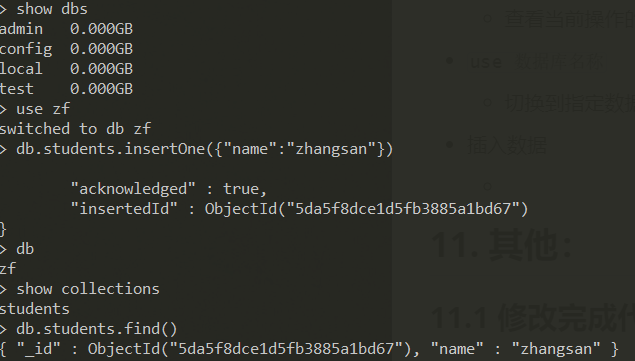

# Node.js


## Node.js 概述

- Node.js 是JavaScript运行时环境

- 可以解析执行JavaScript代码

- 没有BOM 、DOM

- 遵循EcmaScript

- 为JavaScript提供了服务器级别的操作API

- 构建与Chrome的V8引擎之上

  - Google Chrome 中的V8引擎世界上公认的解析执行JavaScript代码最快的

  - Node.js作者把Google Chrome 中的V8引擎移出来，开发了独立的JavaScript运行时环境

  

## Node.js 特性

- event-driven 事件驱动

- non-blocking I/O model 非阻塞IO模型（异步）

- lightweight and efficient 轻量和高效


## Node.js 功能

- WEB服务器后台
  - B/S编程模型（与语言无关）
  - 模块化编程 （类似less  @import('文件路径')  引用加载文件）
  - 异步编程
    - promise
    - async
    - generator 
  
  - Express Web开发框架
  - Ecmascript 6
  
- 命令行工具
  
  - git	（ C ）
  - npm（ Node ）
  - hexo（ Node ）


## Node.js 基本操作


### 执行文件

```shell

## 创建编写js脚本文件
## 打开终端，定位到脚本文件所属目录
## 输入node '文件名' 执行对应的文件  -- 文件名不能以node.js命名否则会打开这个文件

$node begin.js

```


### 读取文件

```js

// 执行文件操作必须引入fs这个核心模块（file-system）
// 使用 require 方法载入fs核心模块

var fs = require('fs')

fs.readFile('url',function(error,data){   // URL：要读取的文件路径 （统一资源定位符）
	if(error){
	 	console.log('读取错误')
        return
    }
    console.log(data.toString())
})
// 读取成功 error 返回 null   ，data 返回 数据									
// 读取失败 error 返回 错误对象，data 返回 undefined

## ps: data 返回的数据是将文件存储的二进制数据 转为 十六进制数据，展现
##	   可以用 toString 方法转为 字符串

## readFile 的第二个参数是可选的，传入 utf8 就是告诉他把读取到的文件直接按照 utf8 编码转成字符串
## 等价于 data.toString()
```


### 读取目录

```javascript

var fs = require('fs')
fs.readdir('url', function(err, files) {  // files: 返回数组
  if (err) {
    res.end('Not Found Root Dir')
    return
  }
  console.log(files)  
})

```


### 写入文件

```js

var fs = require('fs')
fs.writeFile('url','content',function(error){ // content: 写入文件内容   error: 形参
     if(error){
		console.log('写入失败')
     }else{
        console.log('写入成功')
     }
})

## 写入成功 error 返回 null
## 写入失败 error 返回 错误对象

```


### 创建服务器

```javascript

// Node中有一个核心模块 http ,职责创建编写服务器

// 加载http核心模块
var http = require('http')

// 使用http.createServer() 方法创建web服务    ## 返回一个Server实例
var server = http.createServer()

// 接受请求
// 处理请求
// 返回响应

// 注册 request 请求事件
// 当客户端请求时，自动触发服务器的 request 请求事件，然后执行第二个参数：回调处理函数 
server.on('request', function(request,response){
    console.log('收到请求,请求路径' + request.url) 
    response.write('hello')
    response.write(' node.js')
    response.end()
  	// 简化
  	response.end('hello node.js')
})

## request  请求事件处理函数，需接收两个参数：
## Request  请求对象（获取客户端请求信息：如请求路径）
						## req.url 获取端口号以后的路径，所有url都是以 / 开头的 默认为 /
## Response 响应对象（给客户端发送响应信息）有 writer方法 ：给客户端发送响应数据
						## writer方法 ：给客户端发送响应数据
            ## write 可以使用多次，但是最后一定要使用end结束响应，否则客户端会一直等待。
            ## 简化操作 直接end的同时发送响应数据 response.end('str')
            ## response.end()支持两种数据类型：二进制 字符串
            
## response.end()	一次请求对应一次响应，响应结束这次请求也结束  不执行后续代码  类似return
## response.end() 必须存在

// 绑定端口号，启动服务器。

server.listen(3000,function(){
    console.log('服务器启动成功，可以通过 http://127.0.0.1:3000/，进行访问')
})

// 此时终端被服务占用，关闭终端即关闭服务器（X掉，或者 Ctrl+c 终止），有响应便返回响应

```


#### - 创建服务简写

```js

http
		.createServer(function (req, res) {
  
		})
		.listen(3000,function () {
  		console.log('Server is running')
		})
```


### 获取路径

- 采用URL模块，获取

```js

var url = require('url')

var obj =url.parse('http://127.0.0.1:3000/post?name=fasdf&mes= asdf', true)
														// true： 可以让里面的query 将所传入的参数转为对象
console.log(obj)

------------------------------------------
$
  protocol: 'http:',	// 协议
  slashes: true,
  auth: null,
  host: '127.0.0.1:3000',  
  port: '3000',	// 端口号
  hostname: '127.0.0.1',	// 主机名
  hash: null,
  search: '?name=fasdf&mes=%20asdf',	// 查询字符串（ GET参数 ）
  query: [Object: null prototype] { name: 'fasdf', mes: ' asdf' },
  pathname: '/post',
  path: '/post?name=fasdf&mes=%20asdf',
  href: 'http://127.0.0.1:3000/post?name=fasdf&mes=%20asdf' }
```


## Node.js 中 的 JavaScript

- EcmaScript
- 核心模块
- 第三方模块
- 用户自定义模块

### 核心模块

Node为JavaScript提供了很多服务器级别的API，而且这些API绝大多数都被包装到了一个具名的核心模块中。他们都有自己特殊的名称标识，若要使用这些模块，必须用  ***require***  加载模块。

- 文件操作的核心模块：fs
- 服务构建的核心模块：http
- 路径处理的核心模块：path
- 路径操作的核心模块：url
- 操作系统信息的核心模块：os
- ...


```javascript

var path = require('path')
console.log(path.extname('url'))

// 返回扩展名 .txt
```


### 用户定义模块

#### require  方法

​	**用来加载模块，并执行里面的代码**（ 可加载执行多个JavaScript脚本文件 ）

​    **拿到被加载文件模块导出的接口对象**


- node中模块分三种

  - 具名的核心模块 （ fs 、http ...）

  - 用户编写的文件模块

    ​    相对路径必须加 ./ 或 ../    （ ./ 不能省略，否则报错）

    ​	可以省略后缀名

  - 第三方模块

    

    ```js
    console.log('a.js => stat')
    require('./b')
    console.log('a.js => end')
    ```

    

- node中没有全局作用域，只有模块作用域（即文件作用域）

  - 模块是完全封闭的
    - 文件与文件之间可以完全避免变量命名冲突、污染问题
    - 外部访问不到内部，内部访问不到外部


#### exports 对象

**每个文件模块都提供了  *exports*  对象 （ 默认是空对象 ）**

- 由于node只有模块作用域，想要做到模块间通信需要用到  ***exports***

- 把需要被外部访问的成员手动挂载到 ***exports*** 接口对象中

- 多次在 **exports** 添加成员，实现对外导出多个内部成员

- 哪个文件 ***require*** 这个的模块，就可以得到模块内部的   ***exports***  接口对象

  - 即：***require***  的返回值
  
  ```javascript
  
  ## └─ducument
  ##    ├─a.js
  ##    └─b.js
  
  ## ----  b.js content
  
  var foo = '1231234'
  exports.foo = foo
  
  exports.add = function (x, y) {
      return x + y
  }
  
  ------------------------------------------
  
  ## ----  a.js content
  
  var bExports = require('./b')
  console.log(bExports.foo)
  console.log(bExports.add(10, 210))
  
  ```

- 一个模块需要直接导出某个成员，而非挂载的方式必须使用

  `module.exports = add`

  - add 可为 function，string， array。。都可以


## Web 服务端开发


### IP地址  与  端口号


- 所有联网的程序都要进行网络通信

- 计算机中只有一个物理网卡，且同一个局域网中的网卡地址必须唯一。

- 网卡是通过唯一的ip地址进行定位


**IP 地址用来定位计算机**

**端口号用来定位应用程序**

- 所有需要网络通信的软件都必须有端口号
- 端口号使用范围 0 ~ 65536 之间
- 计算机中有一些默认端口号 尽量不去使用 ex : 80 ..
- 一台计算机，同一个端口号在同一时间，只能被一个 
- Node.js 可以开启多个服务，但是一定确保不同服务占用不同端口号


### Content-Type

- 服务端发送的数据默认，是utf-8编码的

- 浏览器在不知道服务器响应内容的编码的情况下，会按照当前操作系统默认的编码去解析
  - 中文操作系统默认编码是 GBK
  - 在http协议中 Content-Type是用来告知，对方给你发送数据内容的数据类型
  - 图片不需要指定编码，常说的编码一般指的是：字符编码，一般只为字符数据指定编码

- **通过设置响应头的方式设置Content-Type的方式解决乱码问题**

  ```js
  
  server.on('request', function(req, res){
      res.setHeader('Content-Type','text/plain; charset=utf-8')
      res.end('hello 世界')
  })
  
  ```

  - 服务器最好把每次响应的数据是什么内容类型 ，正确的告诉客户端
  - 不同的资源对应的 Content-Type 是不一样，具体参照：http://tool.oschina.net/commons
  - 对于文本类型的数据，最好都加上编码，目的是为了防止中文解析乱码问题

  

- 除了用 Content-Type 指定编码，也可以在HTML页面，通过meta元数据（用来 描述、特征、信息，存储内容的数据）来声明当前文本的编码格式


### 请求与响应

- 当浏览器收到HTML的响应内容以后，开始从上到下一次解析，
- 在解析过程中若发现
  - link
  - script
  - img
  - iframe
  - video
  - audio

- 等带有src href属性标签的时候，浏览器会自动对这些资源发起新的请求

  

### 统一资源管理

- 为了方便统一处理静态资源，顾将静态资源存放在同一位置
- 通过代码灵活控制那些资源能被访问，那些资源不允许访问

```js

var http = require('http')
var fs = require('fs')
http
  .createServer(function(req, res) {
    var url = req.url
    if (url === '/') {
      fs.readFile('./view/index.html', function(err, data) {
        if (err) {
          res.end('404 Not Found')
          return
        }
        res.end(data)
      })
    } else if (url.indexOf('/public/') === 0) {   // public 开启访问权限
      fs.readFile('.' + url, function(err, data) {
        if (err) {
          res.end('404 Not Found')
          return
        }
        res.end(data)
      })
    }
  })
  .listen(3000, function() {
    console.log('Server is running')
  })

```

- 上个实例，只有public目录可以提供访问，灵活控制访问资源

  

### 服务器重定向

- 状态码设置 302临时重定向

  - 301为永久重定向 浏览器会记住
  - a  => b ,下次请求a，不经过a 直接到b
  - 302为临时重定向 浏览器会记住
    - a  => b ,下次继续请求a，a  => b
  - response.statusCode = 302
- 响应头中通过 Location告诉客户端往哪重定向

  - response.setHeader( 'Location',  '/' )
- 客户端发现收到的服务器的响应状态码是302，会自动在响应头中找 Location，然后对改地址发起新的请求。
- 客户端自动跳转


## Node中的模块系统


### 前 提

- 使用Node编写应用程序主要是使用
  - EcamScript 语言
  - 核心模块
  - 第三方模块
  - 用户自定义模块

### 模块化

- 文件作用域

- 通信规则

  - 加载

  - 导出

    

### CommonJS模块规范

JavaScript本身并不支持模块化 在Node中不仅支持，还有一个很重要的概念  **模块系统**

- 模块作用域
  - 默认模块中任何内容不能被外部访问
- 使用require方法加载模块
- 使用exports接口对象导出模块中的成员

#### 加载  `require`

##### 语法：

```js
var custom = require('module')
```

##### 作用：

1. 执行被加载模块中代码
2. 得到被加载模块中的  `exports`  导出接口对象

##### 加载规则：

模块查找机制：优先从缓存加载	=>  核心模块  =>  路径形式文件模块  =>  第三方模块

###### 优先从缓存加载

- 优先从缓存加载，不会重复加载，目的是为了避免重复加载，提高模块加载效率

- 可以拿到其中的接口对象，但是不会重复执行里面的代码

  ```js
  ## └─ducument
  ##    ├─a.js
  ##    ├─b.js
  ##    └─main.js
  
  ## ----  main.js content
  
  require('./a')
  var fn = require('./b')
  console.log(fn)
  ----------------------------------
  
  ## ----  a.js content
  
  console.log('a.js 被加载了')
  var fn = require('./b')
  console.log(fn)
  ----------------------------------
  
  ## ----  b.js content
  
  console.log('b.js 被加载了')
  module.exports = function () {
    console.log('hello bbb')
  }
  ----------------------------------
  
  ## ----	 main.js输出结果
  a.js 被加载了
  b.js 被加载了
  [Function]
  [Function]
  ```

  

###### 判断模块模块标识(符)

**require('模块标识')**

- 核心模块
  - 本质：文件。
  - 已被编译到了二进制文件中，只需要按名字加载即可
  - 模块标识 ：模块名
- 第三方模块
  - 凡是第三方模块必须通过npm下载，通过require('包名')进行加载使用
  - 不可能有一个第三方包 与 核心模块 重名
  - 模块标识 ：模块名
- 用户模块
  - 模块标识 ：路径


**路径形式的模块**：

- .js     后缀名可以省略
- ./      当前目录 （不可省略）
- ../     上一级目录 （不可省略）
- /xxx	绝对路径 ( 首位的  / 表示当前文件模块所属磁盘根路径)  ==>  几乎不用
- d:/xxxx  绝对路径   ==>  几乎不用 

**既不是核心模块，也不是路径形式的模块**

1. 模块加载规则
   - 先找到当前文件所属目录中的 `node_modules` 目录    ( 以art-template 为例 )
   - == >     node_modules/art-template
   - == >     node_modules/art-template/package.json 文件
   - == >     node_modules/art-template/package.json 文件中的 main 属性
   - main属性记录了art-template的入口模块 
   - 加载使用art-template
   - 实际上最终加载的还是文件
2. 特殊情况
   - 如果 package.json 文件不存在或者 main指定的入口模块也没有，则 node 会找该目录下的 index.js
     - index.js 会作为默认备选项
   - 若所述所有条件均不成立，则会进人上一级目录中的 node_modules 目录执行查找
   - 若上一级还没有，则继续往上上一级查找
   - 。。。
   - 如果直到当前磁盘根目录还找不到，最后报错  `can not find module xxx` 

**在项目中有且只有一个 `node_modules` ，不会出现多个**

**位置：放在项目根目录中，这样项目中所有子目录中的代码都可以加载第三方包**

#### 导出 `exports`

- Node中是模块作用域，默认文件中所有成员只在当前文件模块有效

- 想要做到模块间通信需要用到  `exports` ，把需要被外部访问的成员手动挂载到 `exports` 接口对象中

  - 导出多个成员（必须在对象中）：

    - 多次在 `exports` 添加成员，实现对外导出多个内部成员

      ```js
      exports.a = 123
      exports.b = 'string'
      exports.c =	function(){
        console.log('string')
      }
      exports.d = {
        foo = 'bar'
      }
      ```

  - 导出单个成员（拿到的是函数、字符串、数组。。。）：

    - 一个模块需要直接导出单个成员，而非挂载的方式必须使用

      ```js
      module.exports = 'string'
      ```

      ```js
      module.exports = function (x, y) {
        return x + y
      }
      ```

    - 若重复使用，则后者覆盖前者

    - 也可以用 `module.exports =` 的操作导出多个成员

      ```js
      module.exports = {
       add: function(x, y){
         return x + y
       },
       str: 'string'
      }
      ```

  

##### 原理

- 在Node 中，每一个模块内部都有一个自己的 `module` 对象

- 该 `module` 对象中，有一个成员叫： `exports` 也是一个对象（ 默认为空 ）

- 若需要对外导出成员，只需要把导出的成员挂载到 `module.exports` 中

- 由于每次导出接口成员的时候都通过 `module.exports.xxx = xxx` 比较麻烦，node为了简化操作专门提供一个变量 `exports`  等价于  `module.exports`  

  ```js
  console.log(exports === module.exports)	// => true
  exports.foo = 'bar'
  //等价于
  module.exports.add = 'bar'
  ```

  固（混搭）：

  ```js
  exports.foo = 'bar'
  module.exports.add = function (x, y) {
    return x + y
  }
  -------------------
  // require结果
  { foo: 'bar', add: [Function] }
  ```

- 当一个模块需要导出单个成员的时候

  - 不能使用：` exports = 'string' ` 

    - `exports` 仅仅只是 `module.exports`  的引用,底层最后的代码是：
      - `var exports = module.exports`
      - `return module.exports`
    - 重新赋值不再指向 `module.exports` , 便丢失了引用关系 
    - 只是快捷方式，可以忽略

  - 只能使用：`module.exports = 'string'`

    - 重新赋值以后 `exports` 便直接失效。

      1. 底层代码：`return module.exports`
      2. 将对象赋值给变量，所存放的是地址

      ```js
      module.exports = 'string'
      exports.foo = 'bar'
      -------------
      // require结果
      'string'
      ```

      

##### 底层代码模拟

```js
var module = {
	exports: { 
	},
  ...
}
// 哪个文件 require 这个的模块，就可以得到 module.exports
// 在node最底层
// 还有一句
var exports = module.exports
// 默认在代码的最后 ：
return module.exports
```


### npm

**node package manager**

#### npm 网站

npmjs.com

#### npm 命令行工具

只要安装了node ,就安装了npm

npm也有版本概念

```shell
npm --version     ## 查看版本
```

```shell
npm install --global npm     ## 升级npm
```

#### npm 常用命令

- npm init [--yes]
  - npm init -y 跳过向导，快速生成
- npm install
  - 一次性把 dependencies 选项中的依赖项全部安装
  - npm i 
- npm install 包名
  - 只下载
  - npm i 包名
- npm install 包名 --save
  - 下载并保存依赖项（ package.json 文件中的 dependencies 选项）
  - npm i -S 包名
- npm uninstall 包名
  - 只删除，如果有依赖项会依然保存
  - npm un 包名
- npm uninstall --save 包名
  - 删除的同时也会把依赖信息也去除
  - npm un -S 包名
- npm help 
  - 查看使用帮助
- npm 命令 --help
  - 查看指定命令的使用帮助

#### 解决npm被墙问题

npm存储包文件的服务器在国外，有时候会被墙，速度很慢

https://npm.taobao.org/ 淘宝的开发团队，把npm在国内做了备份

步骤：

1. 安装淘宝的cnpm：

   ```shell
   npm install --global cnpm
   ## --global表示安装到全局，而非当前目录
   ## 这条命令中 --global不能省略
   ## 所有需要用 --global 来安装的包都可以在任意目录执行
   ```

2. 安装时包时将`npm` 替换成 `cnpm`

   ```shell
   # 这里还是走国外的npm服务器，速度比较慢
   npm install jquery
   # 使用 cnpm 通过淘宝的服务器下载
   cnpm install jquery
   ```

3. 如果不想安装 cnpm 又想使用淘宝的服务器来下载

   ```shell
   npm install jquery --registry=https://registry.npm.taobao.org
   ```

   - 每次手动加参数过于繁琐，可以把这个选项加入配置文件中：

     ```shell
     npm config set registry https://registry.npm.taobao.org
     
     ## 查看npm配置信息
     npm config list
     ```

   - 只要经过上面命令配置，以后所有的` npm install` 都会默认通过淘宝服务器来下载


### package.json

- 每个项目的根目录下都要有一个 package.json 文件 （包描述文件）

- 执行`npm install` 包名的时候都加上 --save，用来 保存依赖项信息

- package.json 可以通过 `npm init `的方式自动初始化出来
  - `dependencies` 选项，保存第三方包的依赖信息
- 若删除了node_modules 文件夹，且package.json 存在
  -  直接使用 `npm install` 找回
     - `npm install` 自动把package.json 中的dependencies 中所有的依赖项，都下载回来.

#### package.json 和 package-lock.json

npm5 以前是不会有 `package-lock.json` 这个文件的

npm5以后才加入的

当你安装包的时候，npm 都会生成或者更新 `package-lock.json` 这个文件

- npm5以后的版本安装包，不需要加 `--save` 参数，他会自动保存依赖信息
- 当安装包的时候，会自动创建或者是更新 `package-lock.json` 这个文件
- `package-lock.json` 会保存 `node_modules` 中所有包的信息（版本、下载地址）
  - 这样的话重新 `npm install` 的时候速度就可以提升
- 从文件看来，有一个 `lock` 称之为 锁
- 这个`lock` 是用来锁定版本的
- 如果项目依赖1.1.1版本
- 你重新install 其实会下载最新版本，而不是1.1.1
- 我们的目的希望可以锁住1.1.1这个版本
- `package-lock.json`这个文件的另一个作用就是锁定版本号，防止自动升级到最新版本

## Node_Express

**原生的http在某些方面不足以应对我们对开发的需求，需要使用框架加快开发效率，框架的目的就是提高效率，让代码更高度统一。**

**在 Node 中有很多web开发框架，Express是其中一种**     http://expressjs.com/


### 起步

#### 安装：

```js
npm install --save express

```


#### hello world

```js
var express = require('express')
// 创建app   =>相当于 http.creataServer
var app = express()
app.get('/', function(req, res) {
  res.send('hello world')
})
app.listen(5000, function() {
  console.log('express app is running...')
})

```


#### 基本路由 router

路由

- 请求方法
- 请求路径
- 请求处理函数

get：

```js
// 当以 get 方法请求 / 的时候，执行对应的处理函数 => 路由 / 映射关系
app.get('/', function(req, res) {
  res.send('hello world')
})

```

post:

```js
// 当以 post 方法请求 / 的时候，执行对应的处理函数 => 路由 / 映射关系
app.post('/', function(req, res) {
  res.send('Got a POST request')
})

```

重定向：

```js
res.redirect('/')

```

#### 静态服务

```js
## └─Project Directory
##    └─public
## 			 └─main.js

// 当以 /public/ 开头的时候 ，去 ./public/ 目录中 查找对应的资源
app.use('/public/', express.static('./public/'))      ## 推荐
--------
## 访问路径：http://127.0.0.1:5000/public/main.js

// 当省略第一个参数的时候，可以通过省略/public的方式来访问
app.use(express.static('./public/'))
--------
## 访问路径：http://127.0.0.1:5000/main.js

// /a 相当于 /public的别名
app.use('/static/', express.static('./public/'))
--------
## 访问路径：http://127.0.0.1:5000/static/main.js


```

#### 在Express中获取表单 GET请求参数

Express内置了一个API，可以直接通过 `req.query` 来获取

```js
req.query

```

#### 在Express中获取表单 POST 请求体数据

在Express中没有内置获取表单 POST 请求体的API，需要主要使用第三方包：`body-parser` 中间件（插件，专门用来解析表单 post 请求体）

安装：

```js
npm install --save body-parser

```

配置：

```js
var express = require('express')
var bodyParser = require('body-parser')

var app = express()

// 配置 body-parser
// 加入这个配置后,则在 req 请求对象上会多出来一个属性： body
// 通过 req.body 获取表单 POST 请求体数据
// parse application/x-www-form-urlencoded
app.use(bodyParser.urlencoded({ extended: false }))
// parse application/json
app.use(bodyParser.json())


```

使用：

```js
app.use(function (req, res) {
  res.setHeader('Content-Type', 'text/plain')
  res.write('you posted:\n')
  // 可以通过 req.body 来获取表单 POST 请求体数据
  res.end(JSON.stringify(req.body, null, 2))
})

```


### 在Express中配置使用art-template模板引擎

- [art-template - GitHub 仓库](https://github.com/aui/art-template)

- [art-template - 官方文档](https://aui.github.io/art-template/zh-cn/index.html)

#### 安装：

```shell
npm install --save art-template
npm install --save express-art-template

```

#### 配置：

```js
app.engine('html', require('express-art-template'))

```

#### 使用：

```js
app.get('/', function(req, res) {
  // express 默认会去项目中的 views 目录中找 index.html
  // render方法 => 渲染文件 详解见说明
  res.render('index.html', {
     title: 'hello world'
  })
})

```

- 如果希望修改默认的 `views` 视图渲染存储目录

  ```js
  // 注意第一个参数 views 千万不能错
  app.set('views', 目录路径)
  
  ```

#### 说明:

- **配置art-template 模板引擎**

  ```js
  app.engine('art', require('express-art-template'))
  
  ```

  - 第一个参数表示：当渲染以 .art 结尾的文件的时候，使用 art-template 模板引擎
    - 个人习惯 `app.engine('html', require('express-art-template'))`
  - express-art-template 是专门用来在 Express 中 把 art-template 整合到 Express中
  - 虽然这里不需要加载 art-template 但是也必须安装
  - 原因是 express-art-template 依赖了 art-template

- **使用art-template 模板引擎**

  - Express 为 Response 相应对象提供了一个方法：render
  - render 方法默认是不可以使用的，但是如果配置了模板引擎就可以使用了

  ```js
  res.render('html模板名', {模板数据})
  
  ```

  - 第一个参数不能写路径，默认会去项目中的 views 目录查找该模板文件
  - Express有个约定，开发人员把所有的视图文件都放到 views 目录中

  ```js
  app.get('/', function(req, res) {
    res.render('index.html')// 若不需要模板引擎渲染，第二个参数不用传，直接渲染文件页面
  })
  
  ```

  - 若要访问 views 下目录中的文件，直接跳过 views/ 即可

  ```js
  ## └─ views
  ##    └─ admin
  ## 			 └─ index.js
  app.get('/admin', function(req, res) {
    res.render('admin/index.html', {
      title: 'index page'
    })
  })
  
  ```

  

## crud案例

### 模块化思想

模块符合划分：

- 模块职责要单一

### 案例

 https://github.com/asnwer-zf/nodeText_express_crud 


## mongoDB

 https://www.runoob.com/mongodb/mongodb-tutorial.html 

### 关系型数据库和非关系型数据库

#### 关系型数据库

表就是关系，或者说表与表之间存在关系

- 所有的关系型数据库都需要通过 `sql` 语言来操作
- 所有的关系型数据库在操作前都需要设计表结构
- 数据表还支持约束
  - 唯一的
  - 主键
  - 默认值
  - 非空

#### 非关系型数据库

非常灵活

- 有的非关系型数据库就是key-value 对
- 在MongoDB是长得最像关系型数据库的非关系型数据库
  - 数据库  - > 数据库
  - 数据表  - > 集合（数组）
  - 表记录  - > (文档对象)
- MongoDB 不需要设计表结构
- 可以任意往里面存数据，没有结构性这么一说

### 安装

- 下载
- 安装
- 配置环境变量
- `mongod --version` 测试是否安装成功

### 启动和关闭数据库

启动:

```shell
# mongodb  默认使用执行 mongod 命令所处盘符根目录下 /data/db 作为自己的数据存储目录
# 在第一次执行该命令之前先自己手动新建一个 /data/db
mongod
```

如果需要修改默认数据存储目录，可以

```shell
mongod --dbpath=数据存储目录路径
```

停止：

```shell
在开启服务的控制台，直接 Ctrl+c 即可停止
或者直接关闭开启服务的控制台
```

### 连接和退出数据库

连接：

```shell
# 该命令默认连接本机的 MongoDB 服务
mongo
```

退出：

```shell
# 在连接状态输入 exit 退出连接
exit
```

### 基本命令

- `show dbs`

  - 查看显示书友数据库

- `db`

  - 查看当前操作的数据库

- `use 数据库名称`

  - 切换到指定数据库（如果没用会新建）

- 插入数据

  

### 在 Node 中操作 MongoDB 数据库

#### 使用官方 `MongoDB` 包来操作

>  https://github.com/mongodb/node-mongodb-native 

#### 使用第三方 mongoose 来操作 MongoDB 数据库

第三方包：`mongoose` 基于 MongoDB 官方的 `mongodb` 包再一次做了封装。

>  https://mongoosejs.com/ 

## 其他：

### 修改完成代码自动重启

**第三方命令行工具`nodemon`，可以解决频繁修改代码重启服务器问题**

**`nodemon`是基于node.js开发的第三方命令行工具，需要独立安装**

```shell
## 所有需要用 --global 来安装的包都可以在任意目录执行
npm install --global nodemon
```

**安装完毕以后，使用**

```shell
node app.js
## 执行 nodemon 替换 node
nodemon app.js
```

**通过 `nodemon` 启动的服务，会监视文件变化，当文件发生变化，自动重启服务器**

### 文件操作中的 `/` 与模块标识中的 `/`

- **文件标识中的路径可以省略 `./` **

- **在模块加载中，相对路径中的 `./` 不能省略**


### 所有文件操作的API都是异步操作


