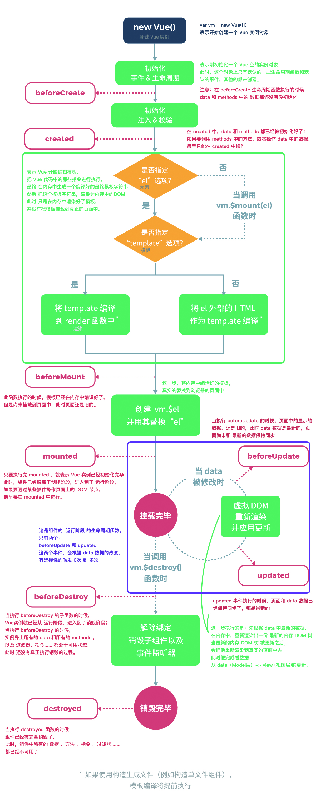

# Vue.js

## Node（后端）中的 MVC 与 前端中的 MVVM 之间的区别

 + MVC 是后端的分层开发概念，分为 Model ，View，Controllers
 + MVVM是前端视图层的概念，主要关注于 视图层分离，也就是说：MVVM把前端的视图层，分为了 三部分 Model, View , VM ViewModel


## Vue 基础

### 基本代码结构

- el  指定要控制的区域   
- data 是个对象，指定了控制的区域内要用到的数据    
- methods 虽然带个s后缀，但是是个对象，这里可以自定义了方法

```vue
...
<!-- 1. 导入Vue的包 -->
<script src="./lib/vue-2.4.0.js"></script>
<!-- 将来 new 的Vue实例，会控制这个 元素中的所有内容 -->
<!-- Vue 实例所控制的这个元素区域，就是我们的 V  -->
<div id="app">
  <p>{{ msg }}</p>
</div>
<script>
  // 2. 创建一个Vue的实例
  // 当我们导入包之后，在浏览器的内存中，就多了一个 Vue 构造函数
  // 注意：我们 new 出来的这个 vm 对象，就是我们 MVVM中的 VM调度者
  var vm = new Vue({
    el: '#app',  // 表示，当前我们 new 的这个 Vue 实例，要控制页面上的哪个区域
    // 这里的 data 就是 MVVM中的 M，专门用来保存 每个页面的数据的
    data: { // data 属性中，存放的是 el 中要用到的数据
      msg: '欢迎学习Vue' // 通过 Vue 提供的指令，很方便的就能把数据渲染到页面上，程序员不再手动操作DOM元素了【前端的Vue之类的框架，不提倡我们去手动操作DOM元素了】
    }
  })
</script>
```

### 基础数据操作

#### `v-cloak` 、  `v-text` 、`v-html` 、`v-pre`

##### `v-cloak`

```vue
<style>
  [v-cloak] {
     display: none; 
  }
</style>
<div v-cloak>{{ msg }}</div>
```

- 会由于`script` 标签位置的不确定性，会出现闪烁问题

- 相较于 `v-text`  ,插值表达式只会替换自己的这个占位符，不会把 整个元素的内容清空

- 可以使用 `v-cloak` 解决 闪烁问题

##### `v-text`

```vue
<div v-text="msg"></div>
```

- 默认 `v-text` 是没有闪烁问题的
- `v-text`会覆盖元素中原本的内容

##### `v-html`

```vue
<div v-html="msg2">1212112</div>
```

- 能够解析 `html` 标签 并 渲染 前面两个只能把标签当作字符串输出
- 默认 `v-html` 是没有闪烁问题的
- `v-html`会覆盖元素中原本的内容
- 存在安全隐患，
- 本网站内部数据可以使用，来自第三方的数据不可使用

#### `v-bind`

`v-bind`: 是 Vue中，提供的用于绑定属性的指令

```vue
<input type="button" value="按钮" v-bind:title="msg + '123'">
```

- `v-bind:` 指令可以被简写为 `:`要绑定的属性
  - `<input type="button" value="按钮" :title="msg + '123'">`
- `v-bind` 中，可以写合法的JS表达式

#### `v-on` 与 事件修饰符

##### `v-on`

Vue 中提供了 `v-on:` 事件绑定机制

```vue
<input type="button" value="按钮" v-on:click="show" id="app">
<script>
    var vm = new Vue({
      el: '#app',
      methods: { // 这个 methods属性中定义了当前Vue实例所有可用的方法
        show: function () {
          alert('Hello')
        }
      }
    })
</script>
```

- `v-on:` 指令可以被简写为 `@`要绑定的属性
  - `<input type="button" value="按钮" @click="show">`
- 使用事件绑定机制，为元素指定事件处理函数时，如加`()`，就可以给函数传参。

##### 事件修饰符

+ .stop       阻止冒泡

+ .prevent    阻止默认事件

+ .capture    添加事件侦听器时使用事件捕获模式

+ .self       只当事件在该元素本身（比如不是子元素）触发时触发回调

+ .once       事件只触发一次

###### 实例结构

```vue
<style>
  .inner {
    height: 150px;
    background-color: darkcyan;
  }

  .outer {
    padding: 40px;
    background-color: red;
  }
</style>
<div id="app">
  
</div>
<script>
  // 创建 Vue 实例，得到 ViewModel
  var vm = new Vue({
    el: '#app',
    data: {},
    methods: {
      div1Handler() {
        console.log('这是触发了 inner div 的点击事件')
      },
      btnHandler() {
        console.log('这是触发了 btn 按钮 的点击事件')
      },
      linkClick() {
        console.log('触发了连接的点击事件')
      },
      div2Handler() {
        console.log('这是触发了 outer div 的点击事件')
      }
    }
  });
</script>
```

###### 使用`.stop` 阻止冒泡 （里 -> 外）

```vue
<div class="inner" @click="div1Handler">
  <input type="button" value="戳他" @click.stop="btnHandler">
</div>
```

###### 使用 `.prevent` 阻止默认行为

```vue
<a href="http://www.baidu.com" @click.prevent="linkClick">有问题，先去百度</a>
```

###### 使用  .capture 实现捕获触发事件的机制 （外 -> 里）

```vue
<div class="inner" @click.capture="div1Handler">
  <input type="button" value="戳他" @click="btnHandler">
</div>
```

###### 使用 .self 实现只有点击当前元素时候，才会触发事件处理函数

```vue
<div class="inner" @click="div1Handler">
  <input type="button" value="戳他" @click="btnHandler">
</div>
```

- 相较于`.self` 只会阻止自己身上冒泡行为的触发，并不会真正阻止 冒泡的行为

  ```vue
  <div class="outer" @click="div2Handler">
    <div class="inner" @click.self="div1Handler">
      <input type="button" value="戳他" @click="btnHandler">
    </div>
  </div>
  ```

###### 使用 .once 只触发一次事件处理函数

```vue
<a href="http://www.baidu.com" @click.prevent.once="linkClick">有问题，先去百度</a>
```

- 事件修饰符可以串联
- `.prevent` 与 `.once` 前后关系

####  `v-model`（双向数据绑定）

`v-bind:`只能实现数据的单向绑定，从 M 自动绑定到 V，无法实现数据的双向绑定

`v-model` 指令，可以实现表单元素和  Model 中数据的双向数据绑定（只能在表单元素中使用）

```vue
<input type="text" name="" v-model="msg" id="">
```

> 在Vue中，已经实现了数据的双向绑定，每当我们修改了 data 中的数据，Vue会默认监听到数据的改动，自动把最新的数据，应用到页面上

#### 样式操作

##### 使用class样式

1. 数组
```html
<h1 :class="['red', 'thin']">这是一个邪恶的H1</h1>
```

2. 数组中使用三元表达式
```html
<h1 :class="['red', 'thin', isactive?'active':'']">这是一个邪恶的H1</h1>
```

3. 数组中嵌套对象（代替三元表达式，提高代码的可读性）
```html
<h1 :class="['red', 'thin', {'active': isactive}]">这是一个邪恶的H1</h1>
```

4. 直接使用对象

```html
<h1 :class="{red:true, italic:true, active:true, thin:true}">这是一个邪恶的H1</h1>
```

- 在为 class 使用 v-bind 绑定 对象的时候，对象的属性是类名，由于 对象的属性可带引号，也可不带引号，所以 这里我没写引号；  属性的值 是一个标识符

```vue
<h1 :class="obj">这是一个邪恶的H1</h1>
<script>
...
data: {
  ...
  obj: {red:true, italic:true, active:true, thin:true}
  ...
}
...
</script>
```

##### 使用内联样式

1. 直接在元素上通过 `:style` 的形式，书写样式对象
```
<h1 :style="{color: 'red', 'font-size': '40px'}">这是一个善良的H1</h1>
```

2. 将样式对象，定义到 `data` 中，并直接引用到 `:style` 中
 + 在data上定义样式：
```
data: {
        h1StyleObj: { color: 'red', 'font-size': '40px', 'font-weight': '200' }
}
```
 + 在元素中，通过属性绑定的形式，将样式对象应用到元素中：
```
<h1 :style="h1StyleObj">这是一个善良的H1</h1>
```

3. 在 `:style` 中通过数组，引用多个 `data` 上的样式对象
 + 在data上定义样式：
```
data: {
        h1StyleObj: { color: 'red', 'font-size': '40px', 'font-weight': '200' },
        h1StyleObj2: { fontStyle: 'italic' }
}
```
 + 在元素中，通过属性绑定的形式，将样式对象应用到元素中：
```
<h1 :style="[h1StyleObj, h1StyleObj2]">这是一个善良的H1</h1>
```

#### `v-for`和`key`属性

1. 迭代数组

```vue
<ul>
  <li v-for="(item, i) in list">索引：{{i}} --- 姓名：{{item.name}} --- 年龄：{{item.age}}</li>
</ul>
```

2. 迭代对象中的属性

```vue
<!-- 循环遍历对象身上的属性 -->
<!-- 注意：在遍历对象身上的键值对的时候， 除了有 val key ,在第三个位置还有 一个 索引  -->
<p v-for="(val, key, i) in list">值是： {{ val }} --- 键是： {{key}} -- 索引： {{i}}</p>
```

3. 迭代数字

```vue
<!-- 注意：如果使用 v-for 迭代数字的话，前面的 count 值从 1 开始 -->
<p v-for="i in 10">这是第 {{i}} 个P标签</p>
```


> 2.2.0+ 的版本里，**当在组件中使用** v-for 时，key 现在是必须的。

当 Vue.js 用 v-for 正在更新已渲染过的元素列表时，它默认用 “**就地复用**” 策略。如果数据项的顺序被改变，Vue将**不是移动 DOM 元素来匹配数据项的顺序**， 而是**简单复用此处每个元素**，并且确保它在特定索引下显示已被渲染过的每个元素。

为了给 Vue 一个提示，**以便它能跟踪每个节点的身份，从而重用和重新排序现有元素**，你需要为每项提供一个唯一 key 属性。

```vue
<div id="app">

  <div>
    <label>Id:
      <input type="text" v-model="id">
    </label>
    <label>Name:
      <input type="text" v-model="name">
    </label>
    <input type="button" value="添加" @click="add">
  </div>
  <!-- 注意： v-for 循环的时候，key 属性只能使用 number或string -->
  <!-- 注意： key 在使用的时候，必须使用 v-bind 属性绑定的形式，指定 key 的值 -->
  <!-- 在组件中，使用v-for循环的时候，或者在一些特殊情况中，如果 v-for 有问题，必须 在使用 v-for 的同时，指定 唯一的 字符串/数字 类型 :key 值 -->
  <p v-for="item in list" :key="item.id">
    <input type="checkbox">{{item.id}} --- {{item.name}}
  </p>
</div>
<script>
  // 创建 Vue 实例，得到 ViewModel
  var vm = new Vue({
    el: '#app',
    data: {
      id: '',
      name: '',
      list: [
        { id: 1, name: '李斯' },
        { id: 2, name: '嬴政' },
        { id: 3, name: '赵高' },
        { id: 4, name: '韩非' },
        { id: 5, name: '荀子' }
      ]
    },
    methods: {
      add() { // 添加方法
        this.list.unshift({ id: this.id, name: this.name })
      }
    }
  });
</script>
```

#### `v-if` 和 `v-show`

##### `v-if` 

- 每次都会重新删除或创建元素
- 有较高的切换性能消耗

##### `v-show`

- 每次不会重新进行DOM的删除和创建操作，只是切换了元素的 display:none 样式
- 有较高的初始渲染消耗

```vue
<input type="submit" value="切换" @click="flag=!flag">
    <h3 v-if="flag">v-if--------Lorem ipsum dolor, sit amet consectetur adipisicing elit.</h3>
    <h3 v-show="flag">v-show--------Lorem ipsum dolor, sit amet consectetur adipisicing elit.</h3>
```

如果元素涉及到频繁的切换，最好不要使用 v-if, 而是推荐使用 v-show

如果元素可能永远也不会被显示出来被用户看到，则推荐使用 v-if

### 过滤器

- 概念：Vue.js 允许你自定义过滤器，**可被用作一些常见的文本格式化**。
- 过滤器可以用在两个地方：**mustache 插值和 v-bind 表达式**。
- 过滤器应该被添加在 JavaScript 表达式的尾部，由“管道”符指示。
  - 调用：
    - `{{ name | '过滤器名称' }}`

#### 全局过滤器

`Vue.filter('过滤器名称', function () { })`

其中的 function ，第一个参数，已经被规定死了，永远都是 过滤器 管道符前面 传递过来的数据

#### 私有过滤器

在Vue 实例中，增加一个属性值：`filters：{}`

> 注意：当有局部和全局两个名称相同的过滤器时候，会以就近原则进行调用，即：局部过滤器优先于全局过滤器被调用！

#### 实例演示

```vue
<div id="app">
  <div class="panel panel-primary">
    <div class="panel-heading">
      <div class="panel-title">brand management</div>
    </div>
    <div class="panel-body form-inline">
      <label for="">
        Id:
        <input type="text" name="" id="" class="form-control" v-model="id">
      </label>
      <label for="">
        NAME:
        <input type="text" name="" id="" class="form-control" v-model="name">
      </label>
      <input type="button" value="add" class="btn btn-primary" @click="add">
      <label for="">
        搜索:
        <input type="text" name="" id="" class="form-control" v-model="keywords" >
      </label>
    </div>
  </div>
  <table class="table table-bordered table-hover progress-striped">
    <thead>
      <tr>
        <th>Id</th>
        <th>NAME</th>
        <th>Ctime</th>
        <th>Operation</th>
      </tr>
    </thead>
    <tbody>
<!-- 之前， v-for 中的数据，都是直接从 data 上的list中直接渲染过来的 -->
<!-- 现在：自定义一个 search 方法，同时，把所有的关键字，通过传参的形式，传递给了 search 方法 -->
<!-- 在 search 方法内部，通过执行 for 循环，把所有符合 搜索关键字的数据，保存到一个新数组中，返回-->
      <tr v-for="item in search(keywords)" :key="item.id">
        <td>{{item.id}}</td>
        <td>{{item.name}}</td>
        <td>{{ item.Ctime | dateFormat }}</td>
        <td>
          <a href="" @click.prevent="deleteFrom(item.id)">Delete</a>
        </td>
      </tr>
    </tbody>
  </table>
</div>
<script>
  Vue.filter('dateFormat', function (dateStr, pattern = '') {  // 全局过滤器
    // 根据给定的时间字符串，得到特定的时间
    var dt = new Date(dateStr)
    var y = dt.getFullYear()
    var m = (dt.getMonth() + 1).toString().padStart(2, '0')
    var d = dt.getDate().toString().padStart(2, '0')
    if (pattern.toLowerCase === 'yyyy-mm-dd') {
      return `${y}-${m}-${d}`
    }
    var hh = dt.getHours().toString().padStart(2, '0')
    var mm = dt.getMinutes().toString().padStart(2, '0')
    var ss = dt.getSeconds().toString().padStart(2, '0')
    return `${y}-${m}-${d} ${hh}:${mm}:${ss}`
  })
  var vm = new Vue({
    el: '#app',
    data: {
      id: '',
      name: '',
      keywords: '',
      list: [
        { id: 1, name: 'BMW', Ctime: new Date() },
        { id: 2, name: 'BZ', Ctime: new Date() },
      ]
    },
    methods: {
      add() {
        var obj = {
          id: this.id,
          name: this.name,
          Ctime: new Date()
        }
        this.list.push(obj)
        this.id = this.name = ''
      },
      deleteFrom(id) {
        var index = this.list.findIndex(item => item == id)
        this.list.splice(index, 1)
      },
      search(keywords) {
        return this.list.filter(item => {
          if (item.name.includes(keywords)) {
            return true
          }
        })
      }
    },
    filters: { // 私有过滤器
      dateFormat(dateStr, pattern = '') {
        var dt = new Date(dateStr)
        var y = dt.getFullYear()
        var m = (dt.getMonth() + 1).toString().padStart(2, '0')
        var d = dt.getDate().toString().padStart(2, '0')
        if (pattern.toLowerCase === 'yyyy-mm-dd') {
          return `${y}-${m}-${d}`
        }
        var hh = dt.getHours().toString().padStart(2, '0')
        var mm = dt.getMinutes().toString().padStart(2, '0')
        var ss = dt.getSeconds().toString().padStart(2, '0')
        return `${y}-${m}-${d} ${hh}:${mm}:${ss}`
      }
    }
  })
</script>
```

### 键盘修饰符以及自定义键盘修饰符

#### 1.x中自定义键盘修饰符【了解即可】

```js
Vue.directive('on').keyCodes.f2 = 113;
```

#### 2.x中自定义键盘修饰符

1. 通过`Vue.config.keyCodes.名称 = 按键值`来自定义案件修饰符的别名：

```js
Vue.config.keyCodes.f2 = 113;
```

2. 使用自定义的按键修饰符：

```html
<input type="text" v-model="name" @keyup.f2="add">
```

3. 相关文档：

> js 里面的键盘事件对应的键码：http://www.cnblogs.com/wuhua1/p/6686237.html
> vue 2.x 键盘修饰符文档：https://cn.vuejs.org/v2/guide/events.html#键值修饰符

###  自定义指令

#### 全局自定义指令：

使用  `Vue.directive('自定义属性名', { })` 定义全局的自定义指令

- 参数1 ： 指令的名称，注意: 在定义的时候，指令的名称前面，不需要加 v- 前缀
  
- 在调用的时候，必须 在指令名称前 加上 v- 前缀来进行调用
  
- 参数2： 是一个对象，这个对象身上，有一些指令相关的函数，这些函数可以在特定的阶段，执行相关的操作

  >  vue 2.x 自定义指令文档：https://cn.vuejs.org/v2/guide/custom-directive.html

  ```js
  ···
  <input type="text" class="form-control" v-model="keywords" id="search" v-focus v-color="'blue'">// 'blue'不加单引号会当成变量在，data 中找。
  ···
  
  Vue.directive('focus', {
    bind: function (el) { // 每当指令绑定到元素上的时候，会立即执行这个 bind 函数，只执行一次
      // 注意： 在每个 函数中，第一个参数，永远是 el ，表示 被绑定了指令的那个元素，这个 el 参数，是一个原生的JS对象
      // 在元素 刚绑定了指令的时候，还没有 插入到 DOM中去，这时候，调用 focus 方法没有作用
      // 因为，一个元素，只有插入DOM之后，才能获取焦点
      // el.focus()
    },// inserted 表示元素 插入到DOM中的时候，会执行 inserted 函数【触发1次】
    inserted: function (el) {  
      el.focus()
      // 和JS行为有关的操作，最好在 inserted 中去执行，防止 JS行为不生效
    },
    update: function (el) {  // 当VNode更新的时候，会执行 updated， 可能会触发多次
    }
  })
  
  Vue.directive('color', {
  // 样式，只要通过指令绑定给了元素，不管这个元素有没有被插入到页面中去，这个元素肯定有了一个内联的样式
  // 将来元素肯定会显示到页面中，这时候，浏览器的渲染引擎必然会解析样式，应用给这个元素
    bind: function (el, binding) {
      // 和样式相关的操作，一般都可以在 bind 执行
      // console.log(binding.value)      指令的绑定值  				clg: blue
      // console.log(binding.expression) 字符串形式的指令表达式 clg: 'blue'
      el.style.color = binding.value
    }
  })
  ```

  总结 ： 与样式有关的操作，设置到 `bind` 中，与行为有关的操作，设置到 `inserted`  中。

  ​			  `bind` 的执行时机，早与 `inserted` 。

#### 局部自定义指令：

在Vue 实例中，增加一个属性值：`directives：{}`

```html
<input type="text" class="form-control" v-model="keywords" v-fontweight="200">
···
directives: {
  'fontweight': {
    bind(el, binding) {
      el.style.fontWeight = binding.value
    }
  }
}
···
```

#### 自定义属性中函数简写：

若只使用 `bind` 和  `update`  触发相同行为，而不关心其它的钩子。 可简写：

```html
<input type="text" class="form-control" v-model="keywords" v-fontweight="200">
···
directives: {
  // 注意：这个 function 等同于 把 代码写到了 bind 和 update 中去
  'fontsize': function (el, binding) { 
    el.style.fontSize = parseInt(binding.value) + 'px'
  }
}
···
```


### [vue实例的生命周期](https://cn.vuejs.org/v2/guide/instance.html#实例生命周期)

什么是生命周期：从Vue实例创建、运行、到销毁期间，总是伴随着各种各样的事件，这些事件，统称为生命周期！

[生命周期钩子](https://cn.vuejs.org/v2/api/#选项-生命周期钩子)：就是生命周期事件的别名而已；

生命周期钩子 = 生命周期函数 = 生命周期事件



主要的生命周期函数分类：

- 创建期间的生命周期函数：
  - beforeCreate：实例刚在内存中被创建出来，此时，还没有初始化好 data 和 methods 属性
  - created：实例已经在内存中创建OK，此时 data 和 methods 已经创建OK，此时还没有开始 编译模板
  - beforeMount：此时已经完成了模板的编译，但是还没有挂载到页面中
    - 在 beforeMount 执行的时候，页面中的元素，还没有被真正替换过来，只是之前写的一些模板字符串
  - mounted：此时，已经将编译好的模板，挂载到了页面指定的容器中显示
    - 注意： mounted 是 实例创建期间的最后一个生命周期函数，当执行完 mounted 就表示，实例已经被完全创建好了，此时，如果没有其它操作的话，这个实例，就静静的 躺在我们的内存中，一动不动

 - 运行期间的生命周期函数：
   - beforeUpdate：状态更新之前执行此函数， 此时 data 中的状态值是最新的，但是界面上显示的 数据还是旧的，因为此时还没有开始重新渲染DOM节点
   - updated：实例更新完毕之后调用此函数，此时 data 中的状态值 和 界面上显示的数据，都已经完成了更新，界面已经被重新渲染好了！
 - 销毁期间的生命周期函数：
   - beforeDestroy：实例销毁之前调用。在这一步，实例仍然完全可用。
   - destroyed：Vue 实例销毁后调用。调用后，Vue 实例指示的所有东西都会解绑定，所有的事件监听器会被移除，所有的子实例也会被销毁。

### [vue-resource 实现 get, post, jsonp请求](https://github.com/pagekit/vue-resource)

> 除了 vue-resource 之外，还可以使用 `axios` 的第三方包实现实现数据的请求

vue-resource 向 vue 挂载了一个属性 `this.$http`

#### get请求

`Vue.http.get('/Url', [config]).then(successCallback, errorCallback)`

```html
<input type="button" value="get请求" @click="getInfo">
<script>
 ...
  methods: {
    getInfo() {
      this.$http.get('http://www.liulongbin.top:3005/api/getprodlist').then(function (result) {
        // 通过 result.body 拿到服务器返回的成功的数据
        console.log(result.body)
      })
    }
  } 
...
</script>
```

#### post请求

`Vue.http.post('/someUrl', [body], [config]).then(successCallback, errorCallback)`

```html
<input type="button" value="POST" @click="postInfo">
<script>
 ...
postInfo() { // 发起 post 请求   application/x-wwww-form-urlencoded
  //  手动发起的 Post 请求，默认没有表单格式，所以，有的服务器处理不了
  //  通过 post 方法的第三个参数， { emulateJSON: true } 设置 提交的内容类型 为 普通表单数据格式
  this.$http.post('http://www.liulongbin.top:3005/api/post', {}, { emulateJSON: true }).then(result => {
    console.log(result.body)
  })
} 
...
</script>
```

#### jsonp请求

`Vue.http.jsonp('/Url', [config]).then(successCallback, errorCallback)`

```html
<input type="button" value="jsonp请求" @click="jsonpInfo">
<script>
 ...
  jsonpInfo() {
    this.$http.jsonp('http://www.liulongbin.top:3005/api/jsonp').then(result => {
      console.log(result.body)
    })
  }
...
</script>
```

#### jsonp原理

 + 由于浏览器的安全性限制，不允许AJAX访问 协议不同、域名不同、端口号不同的 数据接口，浏览器认为这种访问不安全；
 + 可以通过动态创建script标签的形式，把script标签的src属性，指向数据接口的地址，因为script标签不存在跨域限制，这种数据获取方式，称作JSONP（注意：根据JSONP的实现原理，知晓，JSONP只支持Get请求）；
 + 具体实现过程：

  - 先在客户端定义一个回调方法，预定义对数据的操作；
  - 再把这个回调方法的名称，通过URL传参的形式，提交到服务器的数据接口；
  - 服务器数据接口组织好要发送给客户端的数据，再拿着客户端传递过来的回调方法名称，拼接出一个调用这个方法的字符串，发送给客户端去解析执行；
  - 客户端拿到服务器返回的字符串之后，当作Script脚本去解析执行，这样就能够拿到JSONP的数据了

```js
/---------- node 服务端
server.on('request', (req, res) => {
	const { pathname: url , query} =ulModule.parse(req.url, true)
	// console.log(pathname, query)
	if (url === '/getscript') {
		var data = {
			name: '123',
			agg: 18,
			gender: 'fomale'
		}
		var scriptStr = `${query.callback}(${JSON.stringify(data)})`
		res.end(scriptStr)
	} else {
		res.end('404')
	}
})

/---------- html 客户端
  
<script>
  function showInfo(data) {
    console.log(data)
  }
</script>
<script src="http://127.0.0.1:3000/getscript?callback=showInfo"></script>
```

#### vue-resource 的全局配置

配置根域名：

`Vue.http.options.root = 'http://vue.studyit.io/'`

- 如果通过全局配置了，请求的数据接口 根域名，则 ，在每次单独发起 http 请求的时候，请求的 url 路径，应该以相对路径开头，前面不能带 /  ，否则 不会启用根路径做拼接

启用`emulateJSON` 配置

`Vue.http.options.emulateJSON = true`

- 作用：将 `content-type`设置  `application/x-www-form-urlencoded` 模拟表单发送请求

#### 应用实例

```js
// 核心代码：
Vue.http.options.root = 'http://www.liulongbin.top:3005/'
Vue.http.options.emulateJSON = true
var vm = new Vue({
  el: '#app',
  data: {
    name: '',
    list: [
      { id: 1, name: 'BMW', ctime: new Date() },
      { id: 2, name: 'AD', ctime: new Date() }
    ]
  },
  methods: {
    getAllList() {
      this.$http.get('api/getprodlist').then(result => {
        var data = result.body
        if (data.status !== 0) {
          return console.log('404')
        }
        this.list = data.message
      })
    },
    add() {
      this.$http.post('api/addproduct', { name: this.name }).then(result => {
        if (result.body.status !== 0) {
          return alert('404')
        }
        this.getAllList()
        this.name = ''
      })
    },
    del(id) {
      this.$http.get('api/delproduct/' + id).then(result => {
        if (result.body.status !== 0) {
          return alert('404')
        }
        this.getAllList()
      })
    }
  },
  created() {
    this.getAllList()
  }
})
```

### [Vue中的动画](https://cn.vuejs.org/v2/guide/transitions.html)

#### 使用过渡类名

使用 transition 元素，把 需要被动画控制的元素，包裹起来：

```html
<transition name="zf">
    <h4 v-show="flag">Lorem, ipsum dolor sit amet consectetur.</h4>
</transition>
```

自定义两组样式，来控制 transition 内部的元素实现动画：

```css
/* v-enter 【这是一个时间点】 是进入之前，元素的起始状态，此时还没有开始进入 */
/* v-leave-to 【这是一个时间点】 是动画离开之后，离开的终止状态，此时，元素 动画已经结束了 */
.zf-enter,
.zf-leave-to {
  opacity: 0;
  transform: translateX(150px);
}

/* v-enter-active 【入场动画的时间段】 */
/* v-leave-active 【离场动画的时间段】 */
.zf-enter-active,
.zf-leave-active{
  transition: all 0.8s ease;
}
```

自定义 `v-` 前缀：

在  `transition` 元素中加 `name` 属性后，`css` 中的类名 可将默认的 `v-` 前缀 换成 `name` 的属性值加 `-`，达到区分不同动画。

#### [使用第三方 CSS 动画库](https://cn.vuejs.org/v2/guide/transitions.html#自定义过渡类名)

1. 导入动画类库：

```
<link rel="stylesheet" type="text/css" href="./lib/animate.css">
```

2. 定义 transition 及属性：

```html
<div id="app">
  <input type="button" value="toggle" @click="flag= !flag">
  <transition 
  enter-active-class="bounceIn" 
  leave-active-class="bounceOut" 
  :duration="{ enter: 200, leave: 400 }">
    <h4 v-if="flag" class="animated">
      Lorem ipsum dolor sit amet consectetur, adipisicing elit.
    </h4>
  </transition>
</div>
```

- 使用 `:duration="毫秒值"` 来统一设置 入场 和 离场 时候的动画时长

- 使用 `:duration="{ enter: 200, leave: 400 }"`  来分别设置 入场的时长 和 离场的时长

#### 使用动画钩子函数：（半场动画）

```html
<div id="app">
  <input type="button" value="click" @click="flag = !flag">
  <transition @before-enter="beforeEnter" @enter="enter" @after-enter="afterEnter">
    <div class="ball" v-if="flag"></div>
  </transition>
</div>

<script>
  // 创建 Vue 实例，得到 ViewModel
  var vm = new Vue({
    el: '#app',
    data: {
      flag: false
    },
    methods: {
      // 注意： 动画钩子函数的第一个参数：el，表示 要执行动画的那个DOM元素，是个原生的 JS DOM对象
      // el 是通过 document.getElementById('') 方式获取到的原生JS DOM对象
      beforeEnter(el) {
        // beforeEnter 表示动画入场之前，此时，动画尚未开始，可以 在 beforeEnter 中，设置元素开始动画之前的起始样式
          // 设置小球开始动画之前的，起始位置
        el.style.transform = 'translate(0, 0)'
      },
      enter(el, done) {
        // 这句话，没有实际的作用，但是，如果不写，出不来动画效果；
        // 可以认为 el.offsetWidth/offsetHeight/offsetLeft/offsetTop 会强制动画刷新
        el.offsetWidth
        // enter 表示动画 开始之后的样式，这里，可以设置小球完成动画之后的，结束状态
        el.style.transform = 'translate(150px, 450px)'
        el.style.transition = 'all 1s ease'
        // 这里的 done， 起始就是 afterEnter 这个函数，也就是说：done 是 afterEnter 函数的引用
        done()
      },
      afterEnter(el) {
        // 动画完成之后，会调用 afterEnter
        // 第一个功能，是控制小球的显示与隐藏
        // 第二个功能： 直接跳过后半场动画，让 flag 标识符 直接变为 false
        // 当第二次再点击 按钮的时候， flag  false  ->    true
        this.flag = !this.flag
        // Vue 把一个完整的动画，使用钩子函数，拆分为了两部分：
        // 我们使用 flag 标识符，来表示动画的切换；
        // 刚以开始，flag = false  ->   true   ->   false
      }
    }
  })
</script>
```

#### [v-for 的列表过渡](https://cn.vuejs.org/v2/guide/transitions.html#列表的进入和离开过渡)

1.  定义过渡样式：

   ```css
   .v-enter,
   .v-leave-to {
     opacity: 0;
     transform: translateY(80px);
   }
   
   .v-enter-active,
   .v-leave-active {
     transition: all 0.6s ease;
   }
   ```

2. 定义DOM结构，其中，需要使用 transition-group 组件把v-for循环的列表包裹起来：

   ```html
   <div id="app">
     <div>
       <label for="">
         Id:
         <input type="text" v-model="id">
       </label>
       <label for="">
         Name:
         <input type="text" v-model="name">
       </label>
       <input type="button" value="add" @click="add">
     </div>
     <transition-group appear tag="ul">
       <li v-for="(item, i) in list" :key="item.id" @click="del(i)">
         {{item.id}} --- {{item.name}}
       </li>
     </transition-group>
   </div>
   ```

   - 在实现列表过渡的时候，如果需要过渡的元素，是通过 `v-for` 循环渲染出来的，不能使用 `transition` 包裹，需要使用 `transitionGroup`
   - 如果要为 `v-for` 循环创建的元素设置动画，必须为每一个 元素 设置 `:key` 属性
   - 给 `transition-group` 添加 `appear` 属性，实现页面刚展示出来时候，入场时候的效果
   - 通过 为 `transition-group` 元素，设置 `tag` 属性，指定 `transition-group` 渲染为指定的元素，如果不指定 `tag` 属性，默认，渲染为 `span` 标签

3. 定义 VM中的结构：

   ```js
   var vm = new Vue({
     el: '#app',
     data: {
       id: '',
       name: '',
       list: [
         { id: 1, name: 'qwe' },
         { id: 2, name: 'asd' }
       ]
     },
     methods: {
       add() {
         this.list.push({ id: this.id, name: this.name })
         this.id = this.name = ''
       },
       del(i) {
         this.list.splice(i, 1)
       }
     }
   })
   ```

4. 列表的排序过渡:

   `<transition-group>` 组件还有一个特殊之处。不仅可以进入和离开动画，**还可以改变定位**。要使用这个新功能只需了解新增的 `v-move` 特性，**它会在元素的改变定位的过程中应用**。

   + `v-move` 和 `v-leave-active` 结合使用，能够让列表的过渡更加平缓柔和：

   ```css
   .v-move{
     transition: all 0.6s ease;
   }
   .v-leave-active{
     position: absolute;
   }
   ```

## Vue 中的组件

### 定义：

什么是组件： 组件的出现，就是为了拆分Vue实例的代码量的，能够让我们以不同的组件，来划分不同的功能模块，将来我们需要什么样的功能，就可以去调用对应的组件即可；
组件化和模块化的不同：

 + 模块化： 是从代码逻辑的角度进行划分的；方便代码分层开发，保证每个功能模块的职能单一；
 + 组件化： 是从UI界面的角度进行划分的；前端的组件化，方便UI组件的重用；

### 全局组件定义的三种方式

定义组件的时候，如果要定义全局的组件， `Vue.component('组件的名称', {})`

1. 使用 `Vue.extend` 配合 `Vue.component` 方法：

   ```js
   // 使用 Vue.extend 来创建全局的Vue组件
   var com1 = Vue.extend({
     template: '<h3>Lorem ipsum dolor sit amet consectetur</h3>'
   })
   // 使用 Vue.component('组件的名称', 创建出来的组件模板对象)
   Vue.component('myCom1', com1)
   ```

   简写：

   ```js
   Vue.component('myCom1', Vue.extend({
     template: '<h3>Lorem ipsum dolor sit amet consectetur</h3>'
   }))
   ```

   -  第一个参数: 组件的名称, 将来在引用组件的时候, 就是一个标签形式 来引入 它的
   -  第二个参数:  `Vue.extend` 创建的组件  ,其中 `template`  就是组件将来要展示的HTML内容

   如果要使用组件，直接，把组件的名称，以 HTML 标签的形式，引入到页面中，即可

   ```html
   <div id="app">
     <my-com1></my-com1>
   </div>
   ```

   - 如果使用 Vue.component 定义全局组件的时候，组件名称使用了 驼峰命名，则在引用组件的时候，需要把 大写的驼峰改为小写的字母，同时，两个单词之前，使用 - 链接
   - 如果不使用驼峰,则直接拿名称来使用即可

2. 直接使用 Vue.component 方法：

   ```js
   Vue.component('myCom1', {
         template: '<h3>Lorem ipsum dolor sit amet consectetur</h3>'
       })
   ```

3. 将模板字符串，定义到 `template` 元素中：

   ```js
   Vue.component('myCom1', {
     template: '#tmpl'
   })
   ```

   在 被控制的 `#app` 外面,使用 `template` 元素,定义组件的HTML模板结构

   ```html
   <div id="app">
     <my-Com1></my-Com1>
   </div>
   <template id="tmpl">
     <div>
       <h3>Lorem ipsum dolor sit amet consectetur</h3>
     </div>
   </template>
   ```

`注意 : 不论是哪种方式创建出来的组件,组件的 template 属性指向的模板内容,必须有且只能有唯一的一个根元素`

### 私有组件定义

```js
var vm2 = new Vue({
  el: '#app2',
  components: {
    'myCom2': {
      template: '<h3>consectetur adipisicing elit. Commodi, nihil?</h3>'
    }
  }
})
```

`template: '#tmpl2'`同理全局定义方式。

### 组件中展示数据和响应事件

1. 组件可以有自己的 `data` 数据

   - 组件的 `data` 和 实例的 `data` 有点不一样,实例中的 `data` 可以为一个对象,但是 组件中的 data 必须是一个方法，而且这个方法内部必须返回一个对象
   - 组件中 的`data` 数据,使用方式,和实例中的 `data` 使用方式完全一样

   ```js
   Vue.component('vuecontent', {
     template: '<h2>this is h2,------data is {{msg}}</h2>',
     data() {
       return {
         msg: 'Lorem ipsum dolor sit amet'
       }
     }
   })
   ```

2. 组件可以有自己的 `methods` 响应时间。

   - 使用同 `vue` 实例

### 组件间切换

#### 使用`flag`标识符结合`v-if`和`v-else`切换组件

页面结构：

```html
<div id="app">
  <a href="#" @click.prevent="flag = true">login</a>
  <a href="#" @click.prevent="flag = false">register</a>
  <login v-if="flag"></login>
  <register v-else="flag"></register>
</div>
```

vue实例：

```js
Vue.component('login', {
  template: '<h3>login</h3>'
})
Vue.component('register', {
  template: '<h3>register</h3>'
})
```

#### 使用`components`属性定义局部子组件

Vue提供了 `component` ,来展示对应名称的组件

`component` 是一个占位符, `:is` 属性,可以用来指定要展示的组件的名称

页面结构：

```html
<div id="app">
  <a href="#" @click.prevent="comName = 'login'">login</a>
  <a href="#" @click.prevent="comName = 'register'">register</a>
  <component :is="comName"></component>
</div>
```

vue实例：

```js
var vm = new Vue({
  el: '#app',
  data: {
    comName: 'login' // 当前 component 中的 :is 绑定的组件的名称
  },
  methods: {}
})
```

#### 组件切换的动画应用：

使用 `transition`元素包裹 `component`元素，并设置样式即可

并且通过 `transition`元素中的 `mode` 属性,设置组件切换时候的 模式

页面结构：

```html
<transition mode="out-in">
  <component :is="comName"></component>
</transition>
```

css样式：

```css
.v-enter,
.v-leave-to {
  opacity: 0;
  transform: translateX(100px);
}
.v-enter-active,
.v-leave-active {
  transition: all .8s ease;
}
```

### 组件传值：

#### 父组件向子组件传值：

- 本质：父组件向子组件传递数据 `data`

子组件中，默认无法访问到 父组件中的 `data` 上的数据 和 `methods` 中的方法

父组件，可以在引用子组件的时候， 通过 属性绑定`(v-bind:)` 的形式, 把 需要传递给 子组件的数据，以属性绑定的形式，传递到子组件内部，供子组件使用

```html
<div id="app">
  <com1 :parentmsg="msg"></com1>
</div>
<script>
  var vm = new Vue({
    el: '#app',
    data: {
      msg: '132'
    },
    components: {
      com1: {
        template: '<h1>9-----{{parentmsg}}</h1>',
        props: [ // 把父组件传递过来的 parentmsg 属性，
          			 // 先在 props 数组中，定义一下，这样，才能使用这个数据
          'parentmsg'
        ]
      }
    }
  })
</script>
```

- 与 组建中的 `data`的 区别：
  - 子组件中的 `data` 数据，并不是通过 父组件传递过来的，而是子组件自身私有的，比如： 子组件通过 Ajax ，请求回来的数据，都可以放到 `data` 身上；且 `data` 上的数据，都是可读可写的
  - 组件中的 所有 `props` 中的数据，都是通过 父组件传递给子组件的；且`props` 中的数据，都是只读的，无法重新赋值

#### 子组件向父组件传值：

- 父组件向子组件传递方法 `methods`

父组件向子组件 传递 方法，使用的是 事件绑定机制； `v-on`, 当我们自定义了 一个 事件属性之后，那么，子组件就能够，通过某些方式，来调用 传递进去的 这个 方法

```html
<div id="app">
  <com1 @func="show"></com1> // 切记 show 不能加（），不能传参，表示的是方法而不是调用！
</div>
<template id="tmpl">
  <div>
    <h1>this is component for son </h1>
    <input type="button" value="touch" @click="touch">
  </div>
</template>
<script>
  var com1 = { // 定义了一个字面量类型的 组件模板对象
    template: '#tmpl', // 通过指定了一个 Id, 表示要去加载这个指定Id的 template 元素中的内容，当作组件的HTML结构
    data() {
      return {
        sonmsg: {
          name: 'zf',
          age: 18
        }
      }
    },
    methods: {
      touch() { // 当点击子组件按钮的时候，通过 this.$emit 拿到父组件传递过来的 func 方法，并调用
        this.$emit('func', this.sonmsg)
      }
    }
  }
  var vm = new Vue({
    el: '#app',
    data: {
      datamsgFromSon: null
    },
    methods: {
      show(data) {
        this.datamsgFromSon = data
      }
    },
    components: {
      com1
    }
  })
</script>
```

#### 利用传值原理，在`localStorage`存储数据：

 将数据存放在内存中使用 h5 的新特性 `localStorage`

- `localStorage` 用于长久保存整个网站的数据，保存的数据没有过期时间，直到手动去删除。

-  `localStorage` 中的键值对总是以字符串的形式存储 ，而且是只读的 
-  保存数据：`localStorage.setItem('myCat', 'Tom')` 
-  读取数据：`localStorage.getItem('myCat')`

页面结构：

```html
<div id="app">
  <comment-box @load="loadComments"></comment-box>
  <ul class="list-group">
    <li class="list-group-item" v-for="item in list" :key="item.id">
      <span class="badge">person: {{item.name}}</span>
      <div>{{item.content}}</div>
    </li>
  </ul>
</div>
<template id="tmpl">
  <div>
    <div class="form-group">
      <label for="">person:</label>
      <input type="text" class="form-control" v-model="name">
    </div>
    <div class="form-group">
      <label for="">content:</label>
      <textarea class="form-control" v-model="content"></textarea>
    </div>
    <div class="form-group">
      <input type="button" value="add" class="btn btn-primary" @click="add">
    </div>
  </div>
</template>
```

vue实例：

```js
var commentBox = {
  data() {
    return {
      name: '',
      content: ''
    }
  },
  template: '#tmpl',
  methods: {
    add() {
      var tmpl = {
        id: Date.now(),
        name: this.name,
        content: this.content
      }
      var list = JSON.parse(localStorage.getItem('cmts') || '[]')
      console.log(list);
      list.unshift(tmpl)
      localStorage.setItem('cmts', JSON.stringify(list))
      this.name = this.content = ''
      this.$emit('load')
    }
  },
}
var vm = new Vue({
  el: '#app',
  data: {
    list: null
  },
  methods: {
    loadComments() {
      var list = JSON.parse(localStorage.getItem('cmts') || '[]')
      this.list = list
    }
  },
  components: {
    commentBox
  },
  created() {
    this.loadComments()
  }
})
```

### 使用 `this.$refs` 来获取元素和组件

获取DOM节点： 

1. 目标标签中添加 `ref` 属性，自定义名称

   ```html
   <div id="app">
     <input type="button" value="getDOM" @click="getDOM">
     <h3 ref="content">Lorem ipsum dolor sit amet consectetur adipisicing elit.</h3>
   </div>
   ```

2. 在vue 实例中使用 `this.$refs.自定义名称.innerText`

   ```js
   methods: {
     getDOM() {
       console.log(this.$refs.content.innerText);
     }
   }
   ```

获取组件的数据和方法：
`this.$refs.自定义名称.数据名 / 方法名()`

## Vue 中的路由

1. **后端路由：**对于普通的网站，所有的超链接都是URL地址，所有的URL地址都对应服务器上对应的资源；

2. **前端路由：**对于单页面应用程序来说，主要通过URL中的hash(#号)来实现不同页面之间的切换，同时，hash有一个特点：HTTP请求中不会包含hash相关的内容；所以，单页面程序中的页面跳转主要用hash实现；

3. 在单页面应用程序中，这种通过hash改变来切换页面的方式，称作前端路由（区别于后端路由）；

### 路由的基本使用

1. 安装 `vue-router` 路由模块 （`script`标签引包）
2. 创建一个路由对象， 当 导入 `vue-router` 包之后，在 window 全局对象中，就有了一个 路由的构造函数，叫做 `VueRouter`
3. 在 `new` 路由对象的时候，可以为 构造函数，传递一个配置对象
4. 每个路由规则，都是一个对象，这个规则对象，身上，有两个必须的属性：
   - 属性1 是 `path`， 表示监听 哪个路由链接地址；
   - 属性2 是 `component`， 表示，如果 路由是前面匹配到的 `path` ，则展示 `component` 属性对应的那个组件
     - 注意： `component` 的属性值，必须是一个 组件的模板对象， 不能是 组件的引用名称；
   - 属性2 可以设置 `redirect`，表示 ，重定向所匹配到的 `path`， 属性值为 所重定向的路由
     - 注意：这里的 `redirect` 和 Node 中的 `redirect` 完全是两码事
5. 将路由规则对象，注册到 vm 实例上，用来监听 URL 地址的变化，然后展示对应的组件
6. `router-view` 是 `vue-router` 提供的元素，专门用来 当作占位符的，将来，路由规则，匹配到的组件，就会展示到这个 `router-view` 中去
   - 可以把 `router-view` 认为是一个占位符

```html
<div id="app"> // router-link 默认渲染为一个a 标签，添加 tag 属性可将标签改为值所对应的标签
  <router-link to="/login">login</router-link>  // 不论是不是 a 标签都有点击切换的功能
  <router-link to="/register">register</router-link> 
  <transition mode="out-in"> // 再加 过渡样式 即可使用动画
    <router-view></router-view>
  </transition>
</div>
<script>
  var login = {
    template: '<h3>login</h3>'
  }
  var register = {
    template: '<h3>register</h3>'
  }
  const routerObj = new VueRouter({
    routes: [ // 路由匹配规则
      { path: '/', redirect: '/login' }, // 设置路由重定向
      { path: '/login', component: login },
      { path: '/register', component: register },
    ],
    linkActiveClass: 'zf-active' // 自定义高亮 class 类名，修改 class 即可自定义高亮样式
  })														 // 默认值：'router-link-active'
  // 创建 Vue 实例，得到 ViewModel
  var vm = new Vue({
    el: '#app',
    data: {},
    methods: {},
    router: routerObj
  })
</script>
```

url地址改变  ->  触发路由监听事件（url改变后进行路由规则的匹配） ->  匹配后展示所对应的 `component` 组件 放到 `router-view` 区域

### 路由中的参数

#### 在路由规则中定义参数：

1. 查询字符串传参：`(query)`

   - 使用 查询字符串，给路由传递参数，则 不需要修改 路由规则的 path 属性 
   - 在 vue 实例中，使用 `this.$route.query.key` 即可获取参数

   - 在模板对象中获取参数，在插值表达式中，可省略`this.`

   - 支持多个参数传递 

   ```html
   <div id="app">
     <router-link to="/login?id=10&name=123">login</router-link>
     <router-link to="/register">register</router-link>
     <router-view></router-view>
   </div>
   
   <script>
     var login = {
       template: '<h3>login - page {{ $route.query.id }} -- {{ $route.query.name }}</h3>',
       created() {
         console.log(this.$route.query.id)
       },
     }
     var register = {
       template: '<h3>register - page</h3>'
     }
     const router = new VueRouter({
       routes: [
         { path: '/login', component: login },
         { path: '/register', component: register },
       ]
     })
     var vm = new Vue({
       el: '#app',
       data: {},
       methods: {},
       router
     })
   </script>
   ```

   

2. `:id`方式传参：`(params)`

   ```js
   var login = {
     template: '<h3>login - page -- {{ $route.params.id }} --{{ $route.params.name }}</h3>',
     created() {
       console.log(this.$route.params.id)
     },
   }
   var register = {
     template: '<h3>register - page</h3>'
   }
   const router = new VueRouter({
     routes: [
       { path: '/login/:id/:name', component: login },
       { path: '/register', component: register },
     ]
   })
   ```

### 路由跳转

在网页中，有两种跳转方式：

方式1： 使用 a 标签 的形式叫做 标签跳转

方式2： 使用 `window.location.href` 的形式，叫做 编程式导航

#### `this.$route` or `this.$router`

`this.$route` 指的是：路由【参数对象】，所有路由中的参数，`params,query` 都属于他

`this.$router` 指的是：一个路由【导航对象】，用它 可以方便使用 JS 代码，实现路由的前进、后退、跳转到新的 URL 地址

- [编程式导航](https://router.vuejs.org/zh/guide/essentials/navigation.html)

- 其中的 name 属性需要在 配置路由中的 route 自定义 name 来相互匹配 代替 path

  

###  路由嵌套

- 使用`children`属性实现路由嵌套

```html
<div id="app">
  <router-link to="/account">account</router-link>
  <router-view></router-view>
</div>

<template id="tmpl">
  <div>
    <h1>this is component</h1>
    <router-link to="/account/login">login</router-link>
    <router-link to="/account/register">register</router-link>
    <router-view></router-view>
  </div>
</template>
<script>
  var account = {
    template: '#tmpl',
  }
  var login = {
    template: '<h3>login</h3>'
  }
  var register = {
    template: '<h3>register</h3>'
  }
  var router = new VueRouter({
    routes: [
      {
        path: '/account',
        component: account,
        children: [ // 使用 children 属性，子路由的 path 前面不要带 / ，否则永远以根路径开始请求
          { path: 'login', component: login },
          { path: 'register', component: register },
        ]
      }
    ]
  })
  // 创建 Vue 实例，得到 ViewModel
  var vm = new Vue({
    el: '#app',
    data: {},
    methods: {},
    router
  })
</script>
```

### 命名视图

```html
<div id="app">
  <router-view></router-view>
  <router-view name="side"></router-view> // 组件添加 name 属性
  <router-view name="main"></router-view>
</div>
<script>
  var header = {
    template: '<h3>header - page </h3>'
  }
  var sidebar = {
    template: '<h3>sidebar - page </h3>'
  }
  var mainbox = {
    template: '<h3>mainbox - page </h3>'
  }
  var router = new VueRouter({
    routes: [
      {
        path: '/', components: { // 使用 components 配置同级路由
          default: header,
          side: sidebar,
          main: mainbox
        }
      }
    ]
  })
  var vm = new Vue({
    el: '#app',
    data: {},
    methods: {},
    router
  })
</script>
```


## Vue实例 中的其他属性

### 监听数据的变化

#### Vue 实例中的 `watch` 属性：

- 可以监视 data 中指定数据的变化，然后触发这个 watch 中对应的 function 处理函数

- 可以传递两个参数，第一个参数是指定数据改变后的数据，第二个参数是最近一次更改前的数据
- 使用 `watch` 的优势，可以监听非 DOM 元素的改变，`ex：路由改变, wacth监听 $route.path 即可` 这是事件绑定做不到的

```html
<div id="app">
  <input type="text" v-model="firstname"> +
  <input type="text" v-model="lastname"> =
  <input type="text" v-model="fullname">
</div>
<script>
  // 创建 Vue 实例，得到 ViewModel
  var vm = new Vue({
    el: '#app',
    data: {
      firstname: '',
      lastname: '',
      fullname: ''
    },
    methods: {},
    watch: {
      'firstname': function (newVal, oldVal) { // key 为所要监听的变量 ex: '$route.path'
        this.fullname = newVal + '-' + this.lastname
      },
      lastname(newVal) {
        this.fullname = this.firstname + newVal
      },
    },
  })
</script>
```

#### Vue 实例中的 `computed` 属性：

在 `computed` 中，可以定义一些 属性，这些属性，叫做 【计算属性】， 计算属性的，本质，就是 一个方法，只不过，我们在使用 这些计算属性的时候，是把 它们的 名称，直接当作 属性来使用的；并不会把 计算属性，当作方法去调用.

- 计算属性，在引用的时候，一定不要加 () 去调用，直接把它 当作 普通 属性去使用
- 只要 计算属性，这个 `function` 内部，所用到的 任何 `data` 中的数据发送了变化，就会 立即重新计算 这个 计算属性的值
- 计算属性的求值结果，会被缓存起来，方便下次直接使用； 如果 计算属性方法中，所以来的任何数据，都没有发生过变化，则，不会重新对 计算属性求值

```html
<div id="app">
  <input type="text" v-model="firstname"> +
  <input type="text" v-model="lastname"> =
  <input type="text" v-model="fullname">
</div>

<script>
  // 创建 Vue 实例，得到 ViewModel
  var vm = new Vue({
    el: '#app',
    data: {
      firstname: '',
      lastname: '',
    },
    methods: {},
    computed: {
      fullname() {
        return this.firstname + '-' + this.lastname
      }
    },
  })
</script>
```

#### `watch`、`computed`和`methods`之间的对比

1. `computed`属性的结果会被缓存，除非依赖的响应式属性变化才会重新计算。主要当作属性来使用(操作数据)
2. `methods`方法表示一个具体的操作，主要书写业务逻辑；(方法调用)
3. `watch`一个对象，键是需要观察的表达式，值是对应回调函数。主要用来监听某些特定数据的变化，从而进行某些具体的业务逻辑操作；可以看作是`computed`和`methods`的结合体；(监听虚拟的数据，ex：router)

### 使用`render`渲染页面：

```js
var login = {
  template: '<h1>这是登录组件</h1>'
}

// 创建 Vue 实例，得到 ViewModel
var vm = new Vue({
  el: '#app',
  data: {},
  methods: {},
  render: function (createElements) { // createElements 是一个 方法，调用它，能够把 指定的 组件模板，渲染为 html 结构
    return createElements(login)
    // 注意：这里 return 的结果，会 替换页面中 el 指定的那个 容器
  }
});
```


## Vuex

概念：
vuex 是 Vue 配套的 公共数据管理工具，它可以把一些共享的数据，保存到 vuex 中，方便 整个程序中的任何组件直接获取或修改我们的公共数据；

[Vuex](https://vuex.vuejs.org/zh/)


- vuex是 为了保存组件间共享数据而诞生的，如果组件间有要共享的数据， 可以直接挂载到 vuex 中，不必通过父子组件传值，不需要共享的私有数据不必挂载到vuex中vuex是 为了保存组件间共享数据而诞生的，如果组件间有要共享的数据， 可以直接挂载到 vuex 中，不必通过父子组件传值，不需要共享的私有数据不必挂载到vuex中
  - vuex 是 全局数据共享区域

配置vuex的步骤

1. 运行 `cnpm i vuex -S` 

2. 导入包 `import Vuex from 'vuex'`
3. 注册`vuex`到`vue`中 `Vue.use(Vuex)`
4. `new Vuex.Store()` 实例，得到一个 数据仓储对象

```js
var store = new Vuex.Store({
  state: {
    // 大家可以把 state 想象成 组件中的 data ,专门用来存储数据的
    // 如果在 组件中，想要访问，store 中的数据，只能通过 this.$store.state.*** 来访问
    count: 0
  },
  mutations: {
    // 注意： 如果要操作 store 中的 state 值，只能通过 调用 mutations 提供的方法，才能操作对应的数据，不推荐直接操作 state 中的数据，因为 万一导致了数据的紊乱，不能快速定位到错误的原因，因为，每个组件都可能有操作数据的方法；
    increment(state) {
      state.count++
    },
    // 注意： 如果组件想要调用 mutations 中的方法，只能使用 this.$store.commit('方法名')
    // 这种 调用 mutations 方法的格式，和 this.$emit('父组件中方法名')
    subtract(state, obj) {
      // 注意： mutations 的 函数参数列表中，最多支持两个参数，其中，参数1： 是 state 状态； 参数2： 通过 commit 提交过来的参数；
      console.log(obj)
      state.count -= (obj.c + obj.d)
    }
  },
  getters: {
    // 注意：这里的 getters， 只负责 对外提供数据，不负责 修改数据，如果想要修改 state 中的数据，请 去找 mutations
    optCount: function (state) {
      return '当前最新的count值是：' + state.count
    }
    // 经过咱们回顾对比，发现 getters 中的方法， 和组件中的过滤器比较类似，因为 过滤器和 getters 都没有修改原数据， 都是把原数据做了一层包装，提供给了 调用者；
    // 其次， getters 也和 computed 比较像， 只要 state 中的数据发生变化了，那么，如果 getters 正好也引用了这个数据，那么 就会立即触发 getters 的重新求值；
  }
})
```

5. 将 vuex 创建的 store 挂载到 VM 实例上， 只要挂载到了 vm 上，任何组件都能使用 store 来存取数据

总结：

1. state中的数据，不能直接修改，如果想要修改，必须通过 mutations

2. 如果组件想要直接 从 state 上获取数据： 需要 this.$store.state.***

3. 如果 组件，想要修改数据，必须使用 mutations 提供的方法，需要通过 this.$store.commit('方法的名称'， 唯一的一个参数)

4. 如果 store 中 state 上的数据， 在对外提供的时候，需要做一层包装，那么 ，推荐使用 getters, 如果需要使用 getters ,则用 this.$store.getters.***

##相关文档

1. [vue.js 1.x 文档](https://v1-cn.vuejs.org/)
2. [vue.js 2.x 文档](https://cn.vuejs.org/)
3. [String.prototype.padStart(maxLength, fillString)](http://www.css88.com/archives/7715)
4. [js 里面的键盘事件对应的键码](http://www.cnblogs.com/wuhua1/p/6686237.html)
5. [Vue.js双向绑定的实现原理](http://www.cnblogs.com/kidney/p/6052935.html)
6. [pagekit/vue-resource](https://github.com/pagekit/vue-resource)
7. [navicat如何导入sql文件和导出sql文件](https://jingyan.baidu.com/article/a65957f4976aad24e67f9b9b.html)
8. [贝塞尔在线生成器](http://cubic-bezier.com/#.4,-0.3,1,.33)
9. [URL中的hash（井号）](http://www.cnblogs.com/joyho/articles/4430148.html)