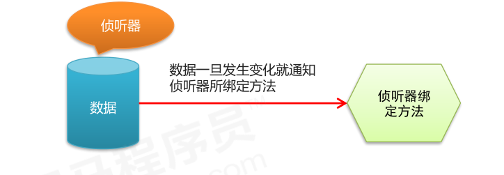

# Vue.js

## Node（后端）中的 MVC 与 前端中的 MVVM 之间的区别

 + MVC 是后端的分层开发概念，分为 Model ，View，Controllers
 + MVVM是前端视图层的概念，主要关注于 视图层分离，也就是说：MVVM把前端的视图层，分为了 三部分 Model, View , VM ViewModel


## Vue 操作

声明式编程：模板的结构和最终显示的效果基本一致

- 与原生js： 字符串拼接DOM，并追加到页面中的编程方式有一定的区别
- 增强编程体验

### 基本代码结构

- el  指定要控制的区域   
- data 是个对象，指定了控制的区域内要用到的数据    
- methods 虽然带个s后缀，但是是个对象，这里可以自定义了方法

```vue
...
<!-- 1. 导入Vue的包 -->
<script src="./lib/vue-2.4.0.js"></script>
<!-- 将来 new 的Vue实例，会控制这个 元素中的所有内容 -->
<!-- Vue 实例所控制的这个元素区域，就是我们的 V  -->
<div id="app">
  <p>{{ msg }}</p>
</div>
<script>
  // 2. 创建一个Vue的实例
  // 当我们导入包之后，在浏览器的内存中，就多了一个 Vue 构造函数
  // 注意：我们 new 出来的这个 vm 对象，就是我们 MVVM中的 VM调度者
  var vm = new Vue({
    el: '#app',  // 表示，当前我们 new 的这个 Vue 实例，要控制页面上的哪个区域
    // 这里的 data 就是 MVVM中的 M，专门用来保存 每个页面的数据的
    data: { // data 属性中，存放的是 el 中要用到的数据
      msg: '欢迎学习Vue' // 通过 Vue 提供的指令，很方便的就能把数据渲染到页面上，程序员不再手动操作DOM元素了【前端的Vue之类的框架，不提倡我们去手动操作DOM元素了】
    }
  })
</script>
```

### Vue 基础

#### 数据绑定：`v-cloak` 、  `v-text` 、`v-html` 、`v-pre`

##### `v-cloak`

```vue
<style>
  [v-cloak] {
     display: none; 
  }
</style>
<div v-cloak>{{ msg }}</div>
```

- 会由于`script` 标签位置的不确定性，会出现闪烁问题

- 相较于 `v-text`  ,插值表达式只会替换自己的这个占位符，不会把 整个元素的内容清空

- 可以使用 `v-cloak` 解决 闪烁问题

##### `v-text`

```vue
<div v-text="msg"></div>
```

- 默认 `v-text` 是没有闪烁问题的
- `v-text`会覆盖元素中原本的内容

##### `v-html`

```vue
<div v-html="msg2">1212112</div>
```

- 能够解析 `html` 标签 并 渲染 前面两个只能把标签当作字符串输出
- 默认 `v-html` 是没有闪烁问题的
- `v-html`会覆盖元素中原本的内容
- 存在安全隐患，
- 本网站内部数据可以使用，来自第三方的数据不可使用

`v-pre`

- 显示原始信息跳过编译过程
- 跳过这个元素和它的子元素的编译过程。
- **一些静态的内容不需要编译加这个指令可以加快渲染**

```vue
<span v-pre>{{ this will not be compiled }}</span>  
// 显示的是{{ this will not be compiled }}
```


#### 数据响应、`v-once`

- 数据的响应式（数据的变化导致页面内容的变化）
- 数据绑定：将数据填充到标签中

`v-once`

- 执行一次性的插值【当数据改变时，插值处的内容不会继续更新】

```vue
<!-- 即使data里面定义了msg 后期我们修改了 仍然显示的是第一次data里面存储的数据-->
<span v-once>{{ msg}}</span>    
```


####  双向数据绑定：`v-model`

- 当数据发生变化的时候，视图也就发生变化
- 当视图发生变化的时候，数据也会跟着同步变化

`v-bind:`只能实现数据的单向绑定，从 M 自动绑定到 V，无法实现数据的双向绑定

`v-model` 指令，可以实现表单元素和  Model 中数据的双向数据绑定（只能在表单元素中使用）

```vue
<input type="text" name="" v-model="msg" id="">
```

> 在Vue中，已经实现了数据的双向绑定，每当我们修改了 data 中的数据，Vue会默认监听到数据的改动，自动把最新的数据，应用到页面上

#### 事件绑定：`v-on`

Vue 中提供了 `v-on:` 事件绑定机制

```vue
<input type="button" value="按钮" v-on:click="show" id="app">
<script>
    var vm = new Vue({
      el: '#app',
      methods: { // 这个 methods属性中定义了当前Vue实例所有可用的方法
        show: function () {
          alert('Hello')
        }
      }
    })
</script>
```

- `v-on:` 指令可以被简写为 `@`要绑定的属性
  - `<input type="button" value="按钮" @click="show">`
- 使用事件绑定机制，为元素指定事件处理函数时，如加`()`，就可以给函数传参。
- 如果事件直接绑定函数名称，那么默认会传递事件对象作为事件函数的第一个参数
- 如果事件绑定函数调用，那么事件对象必须作为最后一个参数显示传递，并且事件对象的名称必须是`$event`

```html
<div id="app">
    <div>{{num}}</div>
    <div>
        <button v-on:click='handle1'>点击1</button>
        <button v-on:click='handle2(123, 456, $event)'>点击2</button>
    </div>
</div>
<script type="text/javascript" src="js/vue.js"></script>
<script type="text/javascript">
    var vm = new Vue({
        el: '#app',
        data: {
            num: 0
        },
        methods: {
            handle1: function(event) {
                console.log(event.target.innerHTML)
            },
            handle2: function(p, p1, event) {
                console.log(p, p1)
                console.log(event.target.innerHTML)
                this.num++;
            }
        }
    });
</script>
```


#### 事件修饰符

+ .stop       阻止冒泡

+ .prevent    阻止默认事件

+ .capture    添加事件侦听器时使用事件捕获模式

+ .self       只当事件在该元素本身（比如不是子元素）触发时触发回调

+ .once       事件只触发一次

###### 实例结构

```vue
<style>
  .inner {
    height: 150px;
    background-color: darkcyan;
  }

  .outer {
    padding: 40px;
    background-color: red;
  }
</style>
<div id="app">
  
</div>
<script>
  // 创建 Vue 实例，得到 ViewModel
  var vm = new Vue({
    el: '#app',
    data: {},
    methods: {
      div1Handler(event) {
        console.log('这是触发了 inner div 的点击事件')
        // 阻止冒泡 （原生js）
        // event.stopPropagation();
      },
      btnHandler() {
        console.log('这是触发了 btn 按钮 的点击事件')
      },
      linkClick(event) {
        console.log('触发了连接的点击事件')
        // 阻止默认行为 （原生js）
        // event.preventDefault();
      },
      div2Handler() {
        console.log('这是触发了 outer div 的点击事件')
      }
    }
  });
</script>
```

###### 使用`.stop` 阻止冒泡 （里 -> 外）

```vue
<div class="inner" @click="div1Handler">
  <input type="button" value="戳他" @click.stop="btnHandler">
</div>
```

###### 使用 `.prevent` 阻止默认行为

```vue
<a href="http://www.baidu.com" @click.prevent="linkClick">有问题，先去百度</a>
```

###### 使用  .capture 实现捕获触发事件的机制 （外 -> 里）

```vue
<div class="inner" @click.capture="div1Handler">
  <input type="button" value="戳他" @click="btnHandler">
</div>
```

###### 使用 .self 实现只有点击当前元素时候，才会触发事件处理函数

```vue
<div class="inner" @click="div1Handler">
  <input type="button" value="戳他" @click="btnHandler">
</div>
```

- 相较于`.self` 只会阻止自己身上冒泡行为的触发，并不会真正阻止 冒泡的行为

  ```vue
  <div class="outer" @click="div2Handler">
    <div class="inner" @click.self="div1Handler">
      <input type="button" value="戳他" @click="btnHandler">
    </div>
  </div>
  ```

###### 使用 .once 只触发一次事件处理函数

```vue
<a href="http://www.baidu.com" @click.prevent.once="linkClick">有问题，先去百度</a>
```

- 事件修饰符可以串联
- `.prevent` 与 `.once` 前后关系

#### 键盘修饰符以及自定义键盘修饰符

##### 1.x中自定义键盘修饰符【了解即可】

```js
Vue.directive('on').keyCodes.f2 = 113;
```

##### 2.x中自定义键盘修饰符

1. 通过`Vue.config.keyCodes.名称 = 按键值`来自定义案件修饰符的别名：

```js
Vue.config.keyCodes.f2 = 113;
```

2. 使用自定义的按键修饰符：

```html
<input type="text" v-model="name" @keyup.f2="add">
```

3. 相关文档：

> js 里面的键盘事件对应的键码：http://www.cnblogs.com/wuhua1/p/6686237.html
> vue 2.x 键盘修饰符文档：https://cn.vuejs.org/v2/guide/events.html#键值修饰符

#### 属性绑定：`v-bind`

`v-bind`: 是 Vue中，提供的用于绑定属性的指令

```vue
<input type="button" value="按钮" v-bind:title="msg + '123'">
```

- `v-bind:` 指令可以被简写为 `:`要绑定的属性
  - `<input type="button" value="按钮" :title="msg + '123'">`
- `v-bind` 中，可以写合法的JS表达式

v-model的低层实现原理分析：

```html
<input v-bind:value="msg" v-on:input="msg=$event.target.value">
```


#### 样式绑定

##### 使用class样式(演示案例忽略 css 样式-- active,error,text,base)

- 对象绑定

  ```html
  <div v-bind:class="{ active: isActive,error: isError}">div</div>
  <script>
  ...
  data:{
    isActive:true,
    isError:true,
    obj: {active:true, error:true}
  }
  ...// 可用事件绑定控制 标识符，实现动态更新 class类名
  </script>
  ```

  - class绑定的值简化操作 : 对象的属性是类名，由于 对象的属性可带引号，也可不带引号；  属性的值 是一个标识符

    ```html
    <div :class="obj">div</div>
    ```

- 数组绑定

  ```html
  <div v-bind:class="[activeClass, errorClass]">div</div>
  <script>
  ...
  data:{
    activeClass: 'active',
    errorClass: 'error',
    isText: true,
    arrClass: ['active', 'error']
  }
  ...
  </script>
  ```

1. 数组中嵌套对象

   ```html
   <div :class="[activeClass,errorClass, {text: isText}]">text</div>
   ```

2. class绑定的值简化操作

   ```html
   <div class="base" :class="arrClass"></div>
   ```

> 默认的class如何处理？默认的class会保留

区别

- 绑定对象的时候 对象的属性 即要渲染的类名 对象的属性值对应的是 data 中的数据 
- 绑定数组的时候数组里面存的是data 中的数据 

##### 使用内联样式

对象绑定：

```html
<div :style="{border: borderStyle, width: widthStyle, height: heightStyle}"></div>
<script>
...
data: {
  borderStyle: '1px solid #0f0',
  widthStyle: '100px',
  heightStyle: '100px',
  objStyles: {
    border: '1px solid #00f',
    width: '50px',
    height: '50px'
  },
  overrideStyles: {
    border: '5px solid orange',
    backgroundColor: 'blue' 
    		// CSS 属性名可以用驼峰式 (camelCase) 或短横线分隔 (kebab-case，记得用单引号括起来)
  }
}
...
</script>
```

简化：

```html
<div :style="objStyles"></div>
```

数组绑定：可以将多个样式对象应用到同一个元素:

```html
<div :style="[objStyles,overrideStyle]"></div>
```


#### 循环结构：`v-for`和`key`属性

1. 遍历数组

```vue
<ul>
  <li v-for="(item, i) in list">索引：{{i}} --- 姓名：{{item.name}} --- 年龄：{{item.age}}</li>
</ul>
```

2. 遍历对象中的属性

   ```html
   <!-- 循环遍历对象身上的属性 -->
   <!-- 注意：在遍历对象身上的键值对的时候， 除了有 val key ,在第三个位置还有 一个 索引  -->
   <p v-for="(val, key, i) in list">值是： {{ val }} --- 键是： {{key}} -- 索引： {{i}}</p>
   ```

3. 遍历数字

```vue
<!-- 注意：如果使用 v-for 迭代数字的话，前面的 count 值从 1 开始 -->
<p v-for="i in 10">这是第 {{i}} 个P标签</p>
```


> 2.2.0+ 的版本里，**当在组件中使用** v-for 时，key 现在是必须的。

当 Vue.js 用 v-for 正在更新已渲染过的元素列表时，它默认用 “**就地复用**” 策略。如果数据项的顺序被改变，Vue将**不是移动 DOM 元素来匹配数据项的顺序**， 而是**简单复用此处每个元素**，并且确保它在特定索引下显示已被渲染过的每个元素。

为了给 Vue 一个提示，**以便它能跟踪每个节点的身份，从而重用和重新排序现有元素**，你需要为每项提供一个唯一 key 属性。

```vue
<div id="app">

  <div>
    <label>Id:
      <input type="text" v-model="id">
    </label>
    <label>Name:
      <input type="text" v-model="name">
    </label>
    <input type="button" value="添加" @click="add">
  </div>
  <!-- 注意： v-for 循环的时候，key 属性只能使用 number或string -->
  <!-- 注意： key 在使用的时候，必须使用 v-bind 属性绑定的形式，指定 key 的值 -->
  <!-- 在组件中，使用v-for循环的时候，或者在一些特殊情况中，如果 v-for 有问题，必须 在使用 v-for 的同时，指定 唯一的 字符串/数字 类型 :key 值 -->
  <p v-for="item in list" :key="item.id">
    <input type="checkbox">{{item.id}} --- {{item.name}}
  </p>
</div>
<script>
  // 创建 Vue 实例，得到 ViewModel
  var vm = new Vue({
    el: '#app',
    data: {
      id: '',
      name: '',
      list: [
        { id: 1, name: '李斯' },
        { id: 2, name: '嬴政' },
        { id: 3, name: '赵高' },
        { id: 4, name: '韩非' },
        { id: 5, name: '荀子' }
      ]
    },
    methods: {
      add() { // 添加方法
        this.list.unshift({ id: this.id, name: this.name })
      }
    }
  });
</script>
```

#### 分支结构： `v-if` 和 `v-show`

##### `v-if / v-else / v-else-if` 

```html
<div id="app">
  <div v-if='score>= 90'>very good</div>
  <div v-else-if='score < 90 && score>= 80'>better</div>
  <div v-else-if='score < 80 && score>= 60'>good</div>
  <div v-else>bad</div>
</div>
<script>
...
data:{
	score: 87
}
...
</script>
```

- 每次都会重新删除或创建元素
- 有较高的切换性能消耗

##### `v-show`

- 每次不会重新进行DOM的删除和创建操作，只是切换了元素的 display:none 样式
- 有较高的初始渲染消耗

```vue
<input type="submit" value="切换" @click="flag=!flag">
<h3 v-if="flag">v-if--------Lorem ipsum dolor, sit </h3>
<h3 v-show="flag">v-show--------Lorem ipsum dolor, sit</h3>
```

区别：

- v-if控制元素是否渲染到页面
- v-show控制元素是否显示（已经渲染到了页面）

如果元素涉及到频繁的切换，最好不要使用 v-if, 而是推荐使用 v-show

如果元素可能永远也不会被显示出来被用户看到，则推荐使用 v-if

### Vue 高级

#### 表单基本操作

- 获取单选框中的值

  1. 两个单选框需要同时通过v-model 双向绑定 一个值 
  2. 每一个单选框必须要有value属性  且value 值不能一样 
  3. 当某一个单选框选中的时候 v-model  变成 当前的 value值 

  ```html
  <input type="radio" id="male" value="1" v-model='gender'>
  <label for="male">男</label>
  <input type="radio" id="female" value="2" v-model='gender'>
  <label for="female">女</label>
  <script>
  ...
     data: {
       // 默认会让当前的 value 值为 2 的单选框选中
       // gender 的值就是选中的值，我们只需要实时监控他的值就可以了
       gender: 2,  
     }
  ...
  </script>
  ```

- 获取复选框中的值

  1. 通过v-model
  2. 和获取单选框中的值一样 
  3. 复选框 `checkbox` 这种的组合时   data 中的 hobby 要定义成数组 否则无法实现多选
  4. 单独使用 `checkbox` 实现点击全选/全不选 功能时 可用 `v-model='false/true'`,进行双向控制

  ```html
  <div>
     <span>爱好：</span>
     <input type="checkbox" id="ball" value="1" v-model='hobby'>
     <label for="ball">篮球</label>
     <input type="checkbox" id="sing" value="2" v-model='hobby'>
     <label for="sing">唱歌</label>
     <input type="checkbox" id="code" value="3" v-model='hobby'>
     <label for="code">写代码</label>
   </div>
  <script>
  ...
     data: {
        // 默认会让当前的 value 值为 2 和 3 的复选框选中
        hobby: ['2', '3'],
     }
  ...
  </script>
  ```

- 获取下拉框和文本框中的值

  1. 需要给select  通过v-model 双向绑定 一个值 
  2. 每一个option  必须要有value属性  且value 值不能一样 
  3. 当某一个option选中的时候 v-model 改变成 当前的 value值 
  4. 文本框中的值与单选框一样，v-model 绑定
     - 不能再双标签中间处理数据，只能用 v-model 进行数据绑定

  ```html
   <div>
      <span>职业：</span>
       <!--occupation 的值就是选中的值，我们只需要实时监控他的值就可以了-->
       <!-- multiple  多选 -->
      <select v-model='occupation' multiple>
          <option value="0">请选择职业...</option>
          <option value="1">教师</option>
          <option value="2">软件工程师</option>
          <option value="3">律师</option>
      </select>
      <!-- textarea 是 一个双标签   不需要绑定value 属性的  -->
      <textarea v-model='desc'></textarea>
  </div>
  <script>
  ...
     data: {
       // 默认会让当前的 value 值为 2 和 3 的下拉框选中
       occupation: ['2', '3'],
       // 加 multiple 属性后 occupation 的值必须为数组，否则报错
       // 未加多选功能的时候，occupation 的值可以直接为 数值 
       desc: 'nihao'
     }
  ...
  </script>
  ```

#### 表单域修饰符

- .number  转换为数值 `<input type="text" v-model.number="age">`

  - 注意点：	
  - 当开始输入非数字的字符串时，因为Vue无法将字符串转换成数值
  - 所以属性值将实时更新成相同的字符串。即使后面输入数字，也将被视作字符串。
- .trim  自动过滤用户输入的首尾空白字符 `<input type="text" v-model.trim="info">`

  - 只能去掉首尾的 不能去除中间的空格
- .lazy   将input事件切换成change事件 `<input type="text" v-model.lazy="msg">`
  - input 事件 每次输入内容都会被触发
  - change事件 在失去焦点 或者 按下回车键时才触发
  - .lazy 修饰符延迟了同步更新属性值的时机。即将原本绑定在 input 事件的同步逻辑转变为绑定在 change 事件上  即：在失去焦点 或者 按下回车键时才更新

####  自定义指令

##### 全局自定义指令：

使用  `Vue.directive('自定义属性名', { })` 定义全局的自定义指令

- 参数1 ： 指令的名称，注意: 在定义的时候，指令的名称前面，不需要加 v- 前缀

- 在调用的时候，必须 在指令名称前 加上 v- 前缀来进行调用

- 参数2： 是一个对象，这个对象身上，有一些指令相关的函数，这些函数可以在特定的阶段，执行相关的操作

  >  vue 2.x 自定义指令文档：https://cn.vuejs.org/v2/guide/custom-directive.html

  ```js
  ···
  <input type="text" class="form-control" v-model="keywords" id="search" v-focus v-color="'blue'">// 'blue'不加单引号会当成变量在，data 中找。
  ···			   // 可以传 data 中的数据 v-color="msg"
  
  Vue.directive('focus', {
    bind: function (el) { // 每当指令绑定到元素上的时候，会立即执行这个 bind 函数，只执行一次
      // 注意： 在每个 函数中，第一个参数，永远是 el ，表示 被绑定了指令的那个元素，这个 el 参数，是一个原生的JS对象
      // 在元素 刚绑定了指令的时候，还没有 插入到 DOM中去，这时候，调用 focus 方法没有作用
      // 因为，一个元素，只有插入DOM之后，才能获取焦点
      // el.focus()
    },// inserted 表示元素 插入到DOM中的时候，会执行 inserted 函数【触发1次】
    inserted: function (el) {  
      el.focus()
      // 和JS行为有关的操作，最好在 inserted 中去执行，防止 JS行为不生效
    },
    update: function (el) {  // 当VNode更新的时候，会执行 updated， 可能会触发多次
    }
  })
  
  Vue.directive('color', {
  // 样式，只要通过指令绑定给了元素，不管这个元素有没有被插入到页面中去，这个元素肯定有了一个内联的样式
  // 将来元素肯定会显示到页面中，这时候，浏览器的渲染引擎必然会解析样式，应用给这个元素
    bind: function (el, binding) {
      // 和样式相关的操作，一般都可以在 bind 执行
      // console.log(binding.value)      指令的绑定值  				clg: blue
      // console.log(binding.expression) 字符串形式的指令表达式 clg: 'blue'
      el.style.color = binding.value
      // el.style.color = binding.value.color
      // data中的数据 
      // msg:{
    //    color: 'orange'
      // }
  }
  })
  ```
  
  总结 ： 与样式有关的操作，设置到 `bind` 中，与行为有关的操作，设置到 `inserted`  中。
  
  ​			  `bind` 的执行时机，早与 `inserted` 。

##### 局部自定义指令：

在Vue 实例中，增加一个属性值：`directives：{}`

```html
<input type="text" class="form-control" v-model="keywords" v-fontweight="200">
···
directives: {
  'fontweight': {
    bind(el, binding) {
      el.style.fontWeight = binding.value
    }
  }
}
···
```

##### 自定义属性中函数简写：

若只使用 `bind` 和  `update`  触发相同行为，而不关心其它的钩子。 可简写：

```html
<input type="text" class="form-control" v-model="keywords" v-fontweight="200">
···
directives: {
  // 注意：这个 function 等同于 把 代码写到了 bind 和 update 中去
  'fontsize': function (el, binding) { 
    el.style.fontSize = parseInt(binding.value) + 'px'
  }
}
···
```

#### 计算属性

表达式的计算逻辑可能会比较复杂，使用计算属性可以使模板内容更加简洁

- 模板中放入太多的逻辑会让模板过重且难以维护  使用计算属性可以让模板更加的简洁

  - 把模板中复杂的计算逻辑抽取出来，使模板变得更加简单
  - **计算属性是基于它们的响应式依赖（data中的数据）进行缓存的**

  - computed比较适合对多个变量或者对象进行处理后返回一个结果值，也就是数多个变量中的某一个值发生了变化则我们监控的这个值也就会发生变化

  ```html
  <div>{{msg.split('').reverse().join('')}}</div>
  <!-- 当多次调用 reverseString  的时候 
       只要里面的 msg 值不改变 他会把第一次计算的结果直接返回
  		 直到data 中的 msg 值改变 计算属性才会重新发生计算 -->
  <div>{{reverseString}}</div>
  <div>{{reverseString}}</div>
  <!-- 调用methods中的方法的时候  他每次会重新调用 -->
  <div>{{reverseMessage()}}</div>
  <div>{{reverseMessage()}}</div>
  <script>
  ...
  data:{
      msg:'hello'
  },
  methods: {
      reverseMessage: function(){
        console.log('methods')
        return this.msg.split('').reverse().join('');
      }
  },//computed  属性 定义 和 data 已经 methods 平级 
  computed: {
      reverseString: function(){ //  reverseString   这个是自己定义的名字 
          return this.msg.split('').reverse().join('')
      }   // 这里一定要有return 否则 调用 reverseString 的 时候无法拿到结果 
  }
  ...
  </script>
  ```


#### 侦听器 watch

- 使用watch来响应数据的变化
- 一般用于异步或者开销较大的操作
- watch 中的属性 一定是data 中 已经存在的数据 
- **当需要监听一个对象的改变时，普通的watch方法无法监听到对象内部属性的改变，只有data中的数据才能够监听到变化，此时就需要deep属性对对象进行深度监听**




```html
<span><input type="text" v-model.lazy="uname"></span>// TODO: 4. 改为失去焦点触发事件
<span>{{tip}}</span>
<script>
  // 创建 Vue 实例，得到 ViewModel
  var vm = new Vue({
    el: '#app',
    data: {
      uname: '',
      tip: ''
    },
    methods: {
      checkName: function (uname) {
        setTimeout(() => { // TODO: 2. （模拟）调用后台接口（异步）进行用户名的验证
          if (uname === 'admin') {
            this.tip = '用户名存在'
          } else {
            this.tip = '可以使用'
          }
        }, 2000);
      }
    },
    watch: {
      // TODO: 1. 使用侦听器监听用户名的变化
      uname: function (val) {
        this.checkName(val)
        // TODO: 3. 根据验证结果调整提示信息
        this.tip = '正在验证。。。'
      }
    }
  })
</script>
```


#### 过滤器

- 概念：Vue.js 允许你自定义过滤器，**可被用作一些常见的文本格式化**。
- 过滤器可以用在两个地方：**mustache 插值和 v-bind 表达式**。
- 过滤器应该被添加在 JavaScript 表达式的尾部，由“管道”符指示。
  - 调用：
    - `{{ name | 过滤器名称 }}`
    - `v-bind:id=" name | 过滤器名称 "`
- 支持级联操作（同时使用多个）: 把前面 过滤器 的结果在作为下一个过滤器的输入值，在进行处理，再产出新的结果。
- 过滤器不改变真正的`data`，而只是改变渲染的结果，并返回过滤后的版本

##### 全局过滤器

`Vue.filter('过滤器名称', function () { })`

其中的 function ，第一个参数，已经被规定死了，永远都是 过滤器 管道符前面 传递过来的数据

##### 私有过滤器

在Vue 实例中，增加一个属性值：`filters：{}`

> 注意：当有局部和全局两个名称相同的过滤器时候，会以就近原则进行调用，即：局部过滤器优先于全局过滤器被调用！

##### 基本使用：

```html
<div id="app">
  <input type="text" v-model='msg'>
  <div>{{msg | upper}}</div>
  <div>{{msg | upper | lower}}</div>
  <div :abc='msg | upper'>测试数据</div>
</div>
<script type="text/javascript">
  /*
    过滤器
    1、可以用与插值表达式和属性绑定
    2、支持级联操作
  */
  // Vue.filter('upper', function(val) {
  //   return val.charAt(0).toUpperCase() + val.slice(1);
  // });
  Vue.filter('lower', function(val) {
    return val.charAt(0).toLowerCase() + val.slice(1);
  });
  var vm = new Vue({
    el: '#app',
    data: {
      msg: ''
    },
    filters: {
      upper: function(val) {
        return val.charAt(0).toUpperCase() + val.slice(1);
      }
    }
  });
</script>
```

##### 过滤器中传递参数

```html
<div>{{date | format('yyyy-MM-dd')}}</div> 
<script>
Vue.filter('format', function (val, arg) { // 过滤器接受参数从第二个参数开始接收
  if (arg == 'yyyy-MM-dd') {
    return val.getFullYear() + '-' + (val.getMonth() + 1) + '-' + val.getDate()
  }
  return val
})
</script>
```


#### [vue实例的生命周期](https://cn.vuejs.org/v2/guide/instance.html#实例生命周期)

什么是生命周期：从Vue实例创建、运行、到销毁期间，总是伴随着各种各样的事件，这些事件，统称为生命周期！

[生命周期钩子](https://cn.vuejs.org/v2/api/#选项-生命周期钩子)：就是生命周期事件的别名而已；

生命周期钩子 = 生命周期函数 = 生命周期事件


主要的生命周期函数分类：

- 创建期间的生命周期函数：`挂载`（初始化相关属性）
  - beforeCreate：实例刚在内存中被创建出来，此时，还没有初始化好 data 和 methods 属性
    - 在实例初始化之后，数据观测和事件配置之前被调用。此时data 和 methods 以及页面的DOM结构都没有初始化   什么都做不了
  - created：实例已经在内存中创建OK，此时 data 和 methods 已经创建OK，此时还没有开始 编译模板
    - 在实例创建完成后被立即调用
  - beforeMount：此时已经完成了模板的编译，但是还没有挂载到页面中
    - 在 beforeMount 执行的时候，页面中的元素，还没有被真正替换过来，只是之前写的一些模板字符串
  - 在挂载开始之前被调用
  - mounted：此时，已经将编译好的模板，挂载到了页面指定的容器中显示
    - 注意： mounted 是 实例创建期间的最后一个生命周期函数，当执行完 mounted 就表示，实例已经被完全创建好了，此时，如果没有其它操作的话，这个实例，就静静的 躺在我们的内存中，一动不动
    - el被新创建的vm.$el替换，并挂载到实例上去之后调用该钩子。
  
 - 运行期间的生命周期函数：`更新`（元素或组件的变更操作）
   - beforeUpdate：状态更新之前执行此函数， 此时 data 中的状态值是最新的，但是界面上显示的 数据还是旧的，因为此时还没有开始重新渲染DOM节点
     - beforeUpdate 数据更新时调用，发生在虚拟DOM打补丁之前。
   - updated：实例更新完毕之后调用此函数，此时 data 中的状态值 和 界面上显示的数据，都已经完成了更新，界面已经被重新渲染好了！
     - 由于数据更改导致的虚拟DOM重新渲染和打补丁，在这之后会调用该钩子。
 - 销毁期间的生命周期函数：`销毁`（销毁相关属性，目的释放资源）
   - beforeDestroy：实例销毁之前调用。在这一步，实例仍然完全可用。
   - destroyed：Vue 实例销毁后调用。调用后，Vue 实例指示的所有东西都会解绑定，所有的事件监听器会被移除，所有的子实例也会被销毁。

常用：

mounted： 初始化已经完成，页面中模板内容已经存在，可以向里面填充数据了，

- 应用场景： 调用后台接口，获取数据，然后把数据填充到模板里（保证页面中已经有模板内容了）

#### 数组变异方法

- 在 Vue 中，直接修改对象属性的值无法触发响应式。当你直接修改了对象属性的值，你会发现，只有数据改了，但是页面内容并没有改变
- Vue 将被侦听的数组的变异方法进行了包裹，所以它们也将会触发视图更新
- 变异数组方法即保持数组方法原有功能不变的前提下对其进行功能拓展

| `push()`    | 往数组最后面添加一个元素，成功返回当前数组的长度             |
| ----------- | ------------------------------------------------------------ |
| `pop()`     | 删除数组的最后一个元素，成功返回删除元素的值                 |
| `shift()`   | 删除数组的第一个元素，成功返回删除元素的值                   |
| `unshift()` | 往数组最前面添加一个元素，成功返回当前数组的长度             |
| `splice()`  | 有三个参数，第一个是想要删除的元素的下标（必选），第二个是想要删除的个数（必选），第三个是删除 后想要在原位置替换的值 |
| `sort()`    | sort()  使数组按照字符编码默认从小到大排序,成功返回排序后的数组 |
| `reverse()` | reverse()  将数组倒序，成功返回倒序后的数组                  |

#### 替换数组

- 不会改变原始数组，但总是返回一个新数组

| filter | filter() 方法创建一个新的数组，新数组中的元素是通过检查指定数组中符合条件的所有元素。 |
| ------ | ------------------------------------------------------------ |
| concat | concat() 方法用于连接两个或多个数组。该方法不会改变现有的数组 |
| slice  | slice() 方法可从已有的数组中返回选定的元素。该方法并不会修改数组，而是返回一个子数组 |

#### 动态数组响应式数据

- Vue.set(vm.items, indexOfItem, newValue)
- vm.$set(vm.items, indexOfItem, newValue)
  - 参数一表示要处理的数组名称
  - 参数二表示要处理的数组的索引
  - 参数三表示要处理的数组的值

```html
<div id="app">
  <div v-for="(item,i ) in list" :key="i"> {{item}}</div>
  <div>{{info.name}}</div>
  <div>{{info.age}}</div>
  <div>{{info.gender}}</div>
</div>
<script>
  var vm = new Vue({
    el: '#app',
    data: {
      list: ['apple', 'orange', 'banana'],
      info: {
        name: 'lisi',
        age: 12
      }
    }
  })
  vm.list[1] = 'lemon' // 用索引的方式修改数据不是响应式的
  Vue.set(vm.list, '2', 'tomato')
  vm.$set(vm.list, '1', 'pear')
  vm.info.gender = 'male' // 不是响应式的
  vm.$set(vm.info, 'gender', 'male')
</script>    
```


### [vue-resource 实现 get, post, jsonp请求](https://github.com/pagekit/vue-resource)

> 除了 vue-resource 之外，还可以使用 `axios` 的第三方包实现实现数据的请求

vue-resource 向 vue 挂载了一个属性 `this.$http`

#### get请求

`Vue.http.get('/Url', [config]).then(successCallback, errorCallback)`

```html
<input type="button" value="get请求" @click="getInfo">
<script>
 ...
  methods: {
    getInfo() {
      this.$http.get('http://www.liulongbin.top:3005/api/getprodlist').then(function (result) {
        // 通过 result.body 拿到服务器返回的成功的数据
        console.log(result.body)
      })
    }
  } 
...
</script>
```

#### post请求

`Vue.http.post('/someUrl', [body], [config]).then(successCallback, errorCallback)`

```html
<input type="button" value="POST" @click="postInfo">
<script>
 ...
postInfo() { // 发起 post 请求   application/x-wwww-form-urlencoded
  //  手动发起的 Post 请求，默认没有表单格式，所以，有的服务器处理不了
  //  通过 post 方法的第三个参数， { emulateJSON: true } 设置 提交的内容类型 为 普通表单数据格式
  this.$http.post('http://www.liulongbin.top:3005/api/post', {}, { emulateJSON: true }).then(result => {
    console.log(result.body)
  })
} 
...
</script>
```

#### jsonp请求

`Vue.http.jsonp('/Url', [config]).then(successCallback, errorCallback)`

```html
<input type="button" value="jsonp请求" @click="jsonpInfo">
<script>
 ...
  jsonpInfo() {
    this.$http.jsonp('http://www.liulongbin.top:3005/api/jsonp').then(result => {
      console.log(result.body)
    })
  }
...
</script>
```

#### jsonp原理

 + 由于浏览器的安全性限制，不允许AJAX访问 协议不同、域名不同、端口号不同的 数据接口，浏览器认为这种访问不安全；
 + 可以通过动态创建script标签的形式，把script标签的src属性，指向数据接口的地址，因为script标签不存在跨域限制，这种数据获取方式，称作JSONP（注意：根据JSONP的实现原理，知晓，JSONP只支持Get请求）；
 + 具体实现过程：

  - 先在客户端定义一个回调方法，预定义对数据的操作；
  - 再把这个回调方法的名称，通过URL传参的形式，提交到服务器的数据接口；
  - 服务器数据接口组织好要发送给客户端的数据，再拿着客户端传递过来的回调方法名称，拼接出一个调用这个方法的字符串，发送给客户端去解析执行；
  - 客户端拿到服务器返回的字符串之后，当作Script脚本去解析执行，这样就能够拿到JSONP的数据了

```js
/---------- node 服务端
server.on('request', (req, res) => {
	const { pathname: url , query} =ulModule.parse(req.url, true)
	// console.log(pathname, query)
	if (url === '/getscript') {
		var data = {
			name: '123',
			agg: 18,
			gender: 'fomale'
		}
		var scriptStr = `${query.callback}(${JSON.stringify(data)})`
		res.end(scriptStr)
	} else {
		res.end('404')
	}
})

/---------- html 客户端
  
<script>
  function showInfo(data) {
    console.log(data)
  }
</script>
<script src="http://127.0.0.1:3000/getscript?callback=showInfo"></script>
```

#### vue-resource 的全局配置

配置根域名：

`Vue.http.options.root = 'http://vue.studyit.io/'`

- 如果通过全局配置了，请求的数据接口 根域名，则 ，在每次单独发起 http 请求的时候，请求的 url 路径，应该以相对路径开头，前面不能带 /  ，否则 不会启用根路径做拼接

启用`emulateJSON` 配置

`Vue.http.options.emulateJSON = true`

- 作用：将 `content-type`设置  `application/x-www-form-urlencoded` 模拟表单发送请求

#### 应用实例

```js
// 核心代码：
Vue.http.options.root = 'http://www.liulongbin.top:3005/'
Vue.http.options.emulateJSON = true
var vm = new Vue({
  el: '#app',
  data: {
    name: '',
    list: [
      { id: 1, name: 'BMW', ctime: new Date() },
      { id: 2, name: 'AD', ctime: new Date() }
    ]
  },
  methods: {
    getAllList() {
      this.$http.get('api/getprodlist').then(result => {
        var data = result.body
        if (data.status !== 0) {
          return console.log('404')
        }
        this.list = data.message
      })
    },
    add() {
      this.$http.post('api/addproduct', { name: this.name }).then(result => {
        if (result.body.status !== 0) {
          return alert('404')
        }
        this.getAllList()
        this.name = ''
      })
    },
    del(id) {
      this.$http.get('api/delproduct/' + id).then(result => {
        if (result.body.status !== 0) {
          return alert('404')
        }
        this.getAllList()
      })
    }
  },
  created() {
    this.getAllList()
  }
})
```

### [Vue中的动画](https://cn.vuejs.org/v2/guide/transitions.html)

#### 使用过渡类名

使用 transition 元素，把 需要被动画控制的元素，包裹起来：

```html
<transition name="zf">
    <h4 v-show="flag">Lorem, ipsum dolor sit amet consectetur.</h4>
</transition>
```

自定义两组样式，来控制 transition 内部的元素实现动画：

```css
/* v-enter 【这是一个时间点】 是进入之前，元素的起始状态，此时还没有开始进入 */
/* v-leave-to 【这是一个时间点】 是动画离开之后，离开的终止状态，此时，元素 动画已经结束了 */
.zf-enter,
.zf-leave-to {
  opacity: 0;
  transform: translateX(150px);
}

/* v-enter-active 【入场动画的时间段】 */
/* v-leave-active 【离场动画的时间段】 */
.zf-enter-active,
.zf-leave-active{
  transition: all 0.8s ease;
}
```

自定义 `v-` 前缀：

在  `transition` 元素中加 `name` 属性后，`css` 中的类名 可将默认的 `v-` 前缀 换成 `name` 的属性值加 `-`，达到区分不同动画。

#### [使用第三方 CSS 动画库](https://cn.vuejs.org/v2/guide/transitions.html#自定义过渡类名)

1. 导入动画类库：

```
<link rel="stylesheet" type="text/css" href="./lib/animate.css">
```

2. 定义 transition 及属性：

```html
<div id="app">
  <input type="button" value="toggle" @click="flag= !flag">
  <transition 
  enter-active-class="bounceIn" 
  leave-active-class="bounceOut" 
  :duration="{ enter: 200, leave: 400 }">
    <h4 v-if="flag" class="animated">
      Lorem ipsum dolor sit amet consectetur, adipisicing elit.
    </h4>
  </transition>
</div>
```

- 使用 `:duration="毫秒值"` 来统一设置 入场 和 离场 时候的动画时长

- 使用 `:duration="{ enter: 200, leave: 400 }"`  来分别设置 入场的时长 和 离场的时长

#### 使用动画钩子函数：（半场动画）

```html
<div id="app">
  <input type="button" value="click" @click="flag = !flag">
  <transition @before-enter="beforeEnter" @enter="enter" @after-enter="afterEnter">
    <div class="ball" v-if="flag"></div>
  </transition>
</div>

<script>
  // 创建 Vue 实例，得到 ViewModel
  var vm = new Vue({
    el: '#app',
    data: {
      flag: false
    },
    methods: {
      // 注意： 动画钩子函数的第一个参数：el，表示 要执行动画的那个DOM元素，是个原生的 JS DOM对象
      // el 是通过 document.getElementById('') 方式获取到的原生JS DOM对象
      beforeEnter(el) {
        // beforeEnter 表示动画入场之前，此时，动画尚未开始，可以 在 beforeEnter 中，设置元素开始动画之前的起始样式
          // 设置小球开始动画之前的，起始位置
        el.style.transform = 'translate(0, 0)'
      },
      enter(el, done) {
        // 这句话，没有实际的作用，但是，如果不写，出不来动画效果；
        // 可以认为 el.offsetWidth/offsetHeight/offsetLeft/offsetTop 会强制动画刷新
        el.offsetWidth
        // enter 表示动画 开始之后的样式，这里，可以设置小球完成动画之后的，结束状态
        el.style.transform = 'translate(150px, 450px)'
        el.style.transition = 'all 1s ease'
        // 这里的 done， 起始就是 afterEnter 这个函数，也就是说：done 是 afterEnter 函数的引用
        done()
      },
      afterEnter(el) {
        // 动画完成之后，会调用 afterEnter
        // 第一个功能，是控制小球的显示与隐藏
        // 第二个功能： 直接跳过后半场动画，让 flag 标识符 直接变为 false
        // 当第二次再点击 按钮的时候， flag  false  ->    true
        this.flag = !this.flag
        // Vue 把一个完整的动画，使用钩子函数，拆分为了两部分：
        // 我们使用 flag 标识符，来表示动画的切换；
        // 刚以开始，flag = false  ->   true   ->   false
      }
    }
  })
</script>
```

#### [v-for 的列表过渡](https://cn.vuejs.org/v2/guide/transitions.html#列表的进入和离开过渡)

1.  定义过渡样式：

   ```css
   .v-enter,
   .v-leave-to {
     opacity: 0;
     transform: translateY(80px);
   }
   
   .v-enter-active,
   .v-leave-active {
     transition: all 0.6s ease;
   }
   ```

2. 定义DOM结构，其中，需要使用 transition-group 组件把v-for循环的列表包裹起来：

   ```html
   <div id="app">
     <div>
       <label for="">
         Id:
         <input type="text" v-model="id">
       </label>
       <label for="">
         Name:
         <input type="text" v-model="name">
       </label>
       <input type="button" value="add" @click="add">
     </div>
     <transition-group appear tag="ul">
       <li v-for="(item, i) in list" :key="item.id" @click="del(i)">
         {{item.id}} --- {{item.name}}
       </li>
     </transition-group>
   </div>
   ```

   - 在实现列表过渡的时候，如果需要过渡的元素，是通过 `v-for` 循环渲染出来的，不能使用 `transition` 包裹，需要使用 `transitionGroup`
   - 如果要为 `v-for` 循环创建的元素设置动画，必须为每一个 元素 设置 `:key` 属性
   - 给 `transition-group` 添加 `appear` 属性，实现页面刚展示出来时候，入场时候的效果
   - 通过 为 `transition-group` 元素，设置 `tag` 属性，指定 `transition-group` 渲染为指定的元素，如果不指定 `tag` 属性，默认，渲染为 `span` 标签

3. 定义 VM中的结构：

   ```js
   var vm = new Vue({
     el: '#app',
     data: {
       id: '',
       name: '',
       list: [
         { id: 1, name: 'qwe' },
         { id: 2, name: 'asd' }
       ]
     },
     methods: {
       add() {
         this.list.push({ id: this.id, name: this.name })
         this.id = this.name = ''
       },
       del(i) {
         this.list.splice(i, 1)
       }
     }
   })
   ```

4. 列表的排序过渡:

   `<transition-group>` 组件还有一个特殊之处。不仅可以进入和离开动画，**还可以改变定位**。要使用这个新功能只需了解新增的 `v-move` 特性，**它会在元素的改变定位的过程中应用**。

   + `v-move` 和 `v-leave-active` 结合使用，能够让列表的过渡更加平缓柔和：

   ```css
   .v-move{
     transition: all 0.6s ease;
   }
   .v-leave-active{
     position: absolute;
   }
   ```


## Vue中的组件

组件：

- 组件 (Component) 是 Vue.js 最强大的功能之一
- 组件可以扩展 HTML 元素，封装可重用的代码

### 组件注册

#### 全局注册

- `Vue.component('组件名称', { })`     第1个参数是标签名称，第2个参数是一个选项对象
- **全局组件**注册后，任何**vue实例**都可以用

##### 组件基础用

```html
<div id="example">
  <!-- 2、 组件使用 组件名称 是以HTML标签的形式使用  -->  
  <my-component></my-component>
</div>
<script>
    //   注册组件 
    // 1、 my-component 就是组件中自定义的标签名
	Vue.component('my-component', {
      template: '<div>A custom component!</div>'
    })

    // 创建根实例
    new Vue({
      el: '#example'
    })

</script>
```

##### 组件注意事项

- 组件参数的data值必须是函数同时这个函数要求返回一个对象 
  - 使用函数的作用：形成闭包的环境，使每个组件都拥有独立的数据
- 组件模板必须是单个根元素
- 组件模板的内容可以是模板字符串

```HTML
  <div id="app">
     <!-- 
		4、  组件可以重复使用多次 
	    因为data中返回的是一个对象所以每个组件中的数据是私有的
		  即每个实例可以维护一份被返回对象的独立的拷贝   
	--> 
    <button-counter></button-counter>
    <button-counter></button-counter>
    <button-counter></button-counter>
      <!-- 8、必须使用短横线的方式使用组件 -->
     <hello-world></hello-world>
  </div>

<script type="text/javascript">
	//5  如果使用驼峰式命名组件，那么在使用组件的时候，只能在字符串模板中用驼峰的方式使用组件，
  // 7、但是在普通的标签模板中，必须使用短横线的方式使用组件
  Vue.component('HelloWorld', {
    data: function(){
      return {
        msg: 'HelloWorld'
      }
    },
    template: '<div>{{msg}}</div>'
  });
  Vue.component('button-counter', {
    // 1、组件参数的data值必须是函数 
    // 同时这个函数要求返回一个对象  
    data: function(){
      return {
        count: 0
      }
    },
    //  2、组件模板必须是单个根元素
    //  3、组件模板的内容可以是模板字符串  
    template: `
      <div>
        <button @click="handle">点击了{{count}}次</button>
        <button>测试123</button>
    #  6 在字符串模板中可以使用驼峰的方式使用组件	
     <HelloWorld></HelloWorld>
      </div>
    `,
    methods: {
      handle: function(){
        this.count += 2;
      }
    }
  })
  var vm = new Vue({
    el: '#app',
    data: {

    }
  });
</script>
```

#### 局部注册

- 只能在当前注册它的vue实例中使用

```html
<div id="app">
    <my-component></my-component>
</div>
<script>
  // 定义组件的模板
  var Child = {
    template: '<div>A custom component!</div>'
  }
  new Vue({
    //局部注册组件  
    components: {
      // <my-component> 将只在父模板可用  一定要在实例上注册了才能在html文件中使用
      'my-component': Child
    }
  })
 </script>
```

### Vue组件之间传值

#### 父组件向子组件传值

- 父组件发送的形式是以属性的形式绑定值到子组件身上。
- 然后子组件用属性props接收
  - 与 组建中的 `data`的 区别：
    - 子组件中的 `data` 数据，并不是通过 父组件传递过来的，而是子组件自身私有的，比如： 子组件通过 Ajax ，请求回来的数据，都可以放到 `data` 身上；且 `data` 上的数据，都是可读可写的
    - 组件中的 所有 `props` 中的数据，都是通过 父组件传递给子组件的；且`props` 中的数据，都是只读的，无法重新赋值
  - props传递数据原则：单向数据流，只允许父组件向自组建传递数据，不允许子组件直接操作，props中的数据
- 在props中使用驼峰形式，模板中需要使用短横线的形式字符串形式的模板中没有这个限制

```html
  <div id="app">
    <div>{{pmsg}}</div>
     <!--1、menu-item  在 APP中嵌套着 故 menu-item   为  子组件      -->
     <!-- 给子组件传入一个静态的值 -->
    <menu-item title='来自父组件的值'></menu-item>
    <!-- 2、 需要动态的数据的时候 需要属性绑定的形式设置 此时 ptitle  来自父组件data 中的数据 . 
		  传的值可以是数字、对象、数组等等
	-->
    <menu-item :title='ptitle' content='hello'></menu-item>
  </div>

  <script type="text/javascript">
    Vue.component('menu-item', {
      // 3、 子组件用属性props接收父组件传递过来的数据  
      props: ['title', 'content'],
      data: function() {
        return {
          msg: '子组件本身的数据'
        }
      },
      template: '<div>{{msg + "----" + title + "-----" + content}}</div>'
    });
    var vm = new Vue({
      el: '#app',
      data: {
        pmsg: '父组件中内容',
        ptitle: '动态绑定属性'
      }
    });
  </script>
```

#### 子组件向父组件传值

- 子组件用`$emit()`触发事件
- `$emit()`  第一个参数为 自定义的事件名称     第二个参数为需要传递的数据
- 父组件用v-on 监听子组件的事件

```html
<div id="app">
	<div :style='{fontSize: fontSize + "px"}'>{{pmsg}}</div>
 	<!-- 2 父组件用v-on 监听子组件的事件
	这里 enlarge-text  是从 $emit 中的第一个参数对应   handle 为对应的事件处理函数	
	-->	
	<menu-item :parr='parr' @enlarge-text='handle($event)'></menu-item>
</div>
<script type="text/javascript" src="js/vue.js"></script>
<script type="text/javascript">
  /*
    子组件向父组件传值-携带参数
  */
  Vue.component('menu-item', {
    props: ['parr'],
    template: `
      <div>
        <ul>
          <li :key='index' v-for='(item,index) in parr'>{{item}}</li>
        </ul>
    ###  1、子组件用$emit()触发事件
    ### 第一个参数为 自定义的事件名称   第二个参数为需要传递的数据  
        <button @click='$emit("enlarge-text", 5)'>扩大父组件中字体大小</button>
        <button @click='$emit("enlarge-text", 10)'>扩大父组件中字体大小</button>
      </div>
    `
  });
  var vm = new Vue({
    el: '#app',
    data: {
      pmsg: '父组件中内容',
      parr: ['apple','orange','banana'],
      fontSize: 10
    },
    methods: {
      handle: function(val){
        // 扩大字体大小
        this.fontSize += val;
      }
    }
  });
</script>
```

#### 兄弟之间的传递

- 兄弟之间传递数据需要借助于事件中心，通过事件中心传递数据   
  - 提供事件中心    `var hub = new Vue()`
- 传递数据方，通过一个事件触发`hub.$emit(方法名，传递的数据)`
- 接收数据方，通过`mounted(){}` 钩子中  触发`hub.$on()`方法名
- 销毁事件 通过`hub.$off()`方法名销毁之后无法进行传递数据

```html
<div id="app">
  <div>父组件</div>
  <div>
    <button @click='handle'>销毁事件</button>
  </div>
  <test-tom></test-tom>
  <test-jerry></test-jerry>
</div>
<script type="text/javascript" src="js/vue.js"></script>
<script type="text/javascript">
  /*
    兄弟组件之间数据传递
  */
  //1、 提供事件中心
  var hub = new Vue();

  Vue.component('test-tom', {
    data: function(){
      return {
        num: 0
      }
    },
    template: `
      <div>
        <div>TOM:{{num}}</div>
        <div>
          <button @click='handle'>点击</button>
        </div>
      </div>
    `,
    methods: {
      handle: function(){
        //2、传递数据方，通过一个事件触发hub.$emit(方法名，传递的数据)   触发兄弟组件的事件
        hub.$emit('jerry-event', 2);
      }
    },
    mounted: function() {
     // 3、接收数据方，通过mounted(){} 钩子中  触发hub.$on(方法名
      hub.$on('tom-event', (val) => {
        this.num += val;
      });
    }
  });
  Vue.component('test-jerry', {
    data: function(){
      return {
        num: 0
      }
    },
    template: `
      <div>
        <div>JERRY:{{num}}</div>
        <div>
          <button @click='handle'>点击</button>
        </div>
      </div>
    `,
    methods: {
      handle: function(){
        //2、传递数据方，通过一个事件触发hub.$emit(方法名，传递的数据)   触发兄弟组件的事件
        hub.$emit('tom-event', 1);
      }
    },
    mounted: function() {
      // 3、接收数据方，通过mounted(){} 钩子中  触发hub.$on()方法名
      hub.$on('jerry-event', (val) => {
        this.num += val;
      });
    }
  });
  var vm = new Vue({
    el: '#app',
    data: {

    },
    methods: {
      handle: function(){
        //4、销毁事件 通过hub.$off()方法名销毁之后无法进行传递数据  
        hub.$off('tom-event');
        hub.$off('jerry-event');
      }
    }
  });
</script>
```

### 组件插槽

- 组件的最大特性就是复用性，而用好插槽能大大提高组件的可复用能力

#### 匿名插槽

```html
<div id="app">
  <!-- 这里的所有组件标签中嵌套的内容会替换掉slot  如果不传值 则使用 slot 中的默认值  -->  
  <alert-box>有bug发生</alert-box>
  <alert-box>有一个警告</alert-box>
  <alert-box></alert-box>
</div>
<script type="text/javascript">
  /*
    组件插槽：父组件向子组件传递内容
  */
  Vue.component('alert-box', {
    template: `
      <div>
        <strong>ERROR:</strong>
  				# 当组件渲染的时候，这个 <slot> 元素将会被替换为“组件标签中嵌套的内容”。
  				# 插槽内可以包含任何模板代码，包括 HTML
        <slot>默认内容</slot>
      </div>
    `
  });
  var vm = new Vue({
    el: '#app'
  });
</script>
```

#### 具名插槽

- 具有名字的插槽 
- 使用 `<slot>` 中的 "name" 属性绑定元素
- vue 2.6 + 使用 v-slot 取代 slot slot-scope, v-slot: 简写 #

```HTML
<div id="app">
  <base-layout>
     <!-- 2、 通过slot属性来指定, 这个slot的值必须和下面slot组件得name值对应上
      如果没有匹配到 则放到匿名的插槽中   --> 
    <p slot='header'>标题信息</p>
    <p>主要内容1</p>
    <p>主要内容2</p>
    <p slot='footer'>底部信息信息</p>
  </base-layout>
  <base-layout>
    <!-- 注意点：template临时的包裹标签最终不会渲染到页面上     -->  
    <!-- 多标签的情况下使用 -->
    <!-- vue 2.6 + 使用 v-slot 取代 slot slot-scope -->
    <!-- v-slot: 简写 # -->
    <template #header>
      	<!-- <template v-slot:header> -->
        <!-- <template slot="header"> -->
      <p>标题信息1</p>
      <p>标题信息2</p>
    </template>
    <p>主要内容1</p>
    <p>主要内容2</p>
    <template slot='footer'>
      <p>底部信息信息1</p>
      <p>底部信息信息2</p>
    </template>
  </base-layout>
</div>
<script type="text/javascript" src="js/vue.js"></script>
<script type="text/javascript">
  /*
    具名插槽
  */
  Vue.component('base-layout', {
    template: `
      <div>
        <header>
    				###	1、 使用 <slot> 中的 "name" 属性绑定元素 指定当前插槽的名字
          <slot name='header'></slot>
        </header>
        <main>
          <slot></slot>
        </main>
        <footer>
    			  ###  注意点： 
    				###  具名插槽的渲染顺序，完全取决于模板，而不是取决于父组件中元素的顺序
          <slot name='footer'></slot>
        </footer>
      </div>
    `
  });
  var vm = new Vue({
    el: '#app'
  });
</script>
```

####  作用域插槽

- 父组件对子组件加工处理
- 既可以复用子组件的slot，又可以使slot内容不一致
- 2.6+ 以上的版本 用 v-slot 取代 slot-scope, 而且可以配合具名插槽使用

```html
<div id="app">
  <!-- 
  1、当我们希望li 的样式由外部使用组件的地方定义，因为可能有多种地方要使用该组件，
  但样式希望不一样 这个时候我们需要使用作用域插槽 

-->  
  <fruit-list :list='list'>
     <!-- 2、 父组件中使用了<template>元素,而且包含scope="slotProps",
    slotProps在这里只是临时变量   
  ---> 	
    <!-- <template v-slot:default="slotProps"> 未命名可省略default--> 
    <template v-slot="slotProps">
      <!-- template v-slot:zf="slotProps" -->
      <!-- <template slot-scope='slotProps'> -->
      <strong v-if='slotProps.info.id==3' class="current">
          {{slotProps.info.name}}		         
       </strong>
      <span v-else>{{slotProps.info.name}}</span>
    </template>
  </fruit-list>
</div>
<script type="text/javascript" src="js/vue.js"></script>
<script type="text/javascript">
  /*
    作用域插槽
  */
  Vue.component('fruit-list', {
    props: ['list'],
    template: `
      <div>
        <li :key='item.id' v-for='item in list'>
    ###  3、 在子组件模板中,<slot>元素上有一个类似props传递数据给组件的写法msg="xxx",
    ###   插槽可以提供一个默认内容，如果如果父组件没有为这个插槽提供了内容，会显示默认的内容。
        如果父组件为这个插槽提供了内容，则默认的内容会被替换掉
          <slot :info='item'>{{item.name}}</slot>
             ### <slot :info='item' name="zf">{{item.name}}</slot>
        </li>
      </div>
    `
  });
  var vm = new Vue({
    el: '#app',
    data: {
      list: [{
        id: 1,
        name: 'apple'
      },{
        id: 2,
        name: 'orange'
      },{
        id: 3,
        name: 'banana'
      }]
    }
  });
</script>
```


## Vue 中的路由

1. **后端路由：**对于普通的网站，所有的超链接都是URL地址，所有的URL地址都对应服务器上对应的资源；

2. **前端路由：**对于单页面应用程序来说，主要通过URL中的hash(#号)来实现不同页面之间的切换，同时，hash有一个特点：HTTP请求中不会包含hash相关的内容；所以，单页面程序中的页面跳转主要用hash实现；

3. 在单页面应用程序中，这种通过hash改变来切换页面的方式，称作前端路由（区别于后端路由）；

### 路由的基本使用

1. 安装 `vue-router` 路由模块 （`script`标签引包）
2. 创建一个路由对象， 当 导入 `vue-router` 包之后，在 window 全局对象中，就有了一个 路由的构造函数，叫做 `VueRouter`
3. 在 `new` 路由对象的时候，可以为 构造函数，传递一个配置对象
4. 每个路由规则，都是一个对象，这个规则对象，身上，有两个必须的属性：
   - 属性1 是 `path`， 表示监听 哪个路由链接地址；
   - 属性2 是 `component`， 表示，如果 路由是前面匹配到的 `path` ，则展示 `component` 属性对应的那个组件
     - 注意： `component` 的属性值，必须是一个 组件的模板对象， 不能是 组件的引用名称；
   - 属性2 可以设置 `redirect`，表示 ，重定向所匹配到的 `path`， 属性值为 所重定向的路由
     - 注意：这里的 `redirect` 和 Node 中的 `redirect` 完全是两码事
5. 将路由规则对象，注册到 vm 实例上，用来监听 URL 地址的变化，然后展示对应的组件
6. `router-view` 是 `vue-router` 提供的元素，专门用来 当作占位符的，将来，路由规则，匹配到的组件，就会展示到这个 `router-view` 中去
   - 可以把 `router-view` 认为是一个占位符

```html
<div id="app"> // router-link 默认渲染为一个a 标签，添加 tag 属性可将标签改为值所对应的标签
  <router-link to="/login">login</router-link>  // 不论是不是 a 标签都有点击切换的功能
  <router-link to="/register">register</router-link> 
  <transition mode="out-in"> // 再加 过渡样式 即可使用动画
    <router-view></router-view>
  </transition>
</div>
<script>
  var login = {
    template: '<h3>login</h3>'
  }
  var register = {
    template: '<h3>register</h3>'
  }
  const routerObj = new VueRouter({
    routes: [ // 路由匹配规则
      { path: '/', redirect: '/login' }, // 设置路由重定向
      { path: '/login', component: login },
      { path: '/register', component: register },
    ],
    linkActiveClass: 'zf-active' // 自定义高亮 class 类名，修改 class 即可自定义高亮样式
  })														 // 默认值：'router-link-active'
  // 创建 Vue 实例，得到 ViewModel
  var vm = new Vue({
    el: '#app',
    data: {},
    methods: {},
    router: routerObj
  })
</script>
```

url地址改变  ->  触发路由监听事件（url改变后进行路由规则的匹配） ->  匹配后展示所对应的 `component` 组件 放到 `router-view` 区域

### 路由中的参数

#### 在路由规则中定义参数：

1. 查询字符串传参：`(query)`

   - 使用 查询字符串，给路由传递参数，则 不需要修改 路由规则的 path 属性 
   - 在 vue 实例中，使用 `this.$route.query.key` 即可获取参数

   - 在模板对象中获取参数，在插值表达式中，可省略`this.`

   - 支持多个参数传递 

   ```html
   <div id="app">
     <router-link to="/login?id=10&name=123">login</router-link>
     <router-link to="/register">register</router-link>
     <router-view></router-view>
   </div>
   
   <script>
     var login = {
       template: '<h3>login - page {{ $route.query.id }} -- {{ $route.query.name }}</h3>',
       created() {
         console.log(this.$route.query.id)
       },
     }
     var register = {
       template: '<h3>register - page</h3>'
     }
     const router = new VueRouter({
       routes: [
         { path: '/login', component: login },
         { path: '/register', component: register },
       ]
     })
     var vm = new Vue({
       el: '#app',
       data: {},
       methods: {},
       router
     })
   </script>
   ```

   

2. `:id`方式传参：`(params)`

   ```js
   var login = {
     template: '<h3>login - page -- {{ $route.params.id }} --{{ $route.params.name }}</h3>',
     created() {
       console.log(this.$route.params.id)
     },
   }
   var register = {
     template: '<h3>register - page</h3>'
   }
   const router = new VueRouter({
     routes: [
       { path: '/login/:id/:name', component: login },
       { path: '/register', component: register },
     ]
   })
   ```

### 路由跳转

在网页中，有两种跳转方式：

方式1： 使用 a 标签 的形式叫做 标签跳转

方式2： 使用 `window.location.href` 的形式，叫做 编程式导航

#### `this.$route` or `this.$router`

`this.$route` 指的是：路由【参数对象】，所有路由中的参数，`params,query` 都属于他

`this.$router` 指的是：一个路由【导航对象】，用它 可以方便使用 JS 代码，实现路由的前进、后退、跳转到新的 URL 地址

- [编程式导航](https://router.vuejs.org/zh/guide/essentials/navigation.html)

- 其中的 name 属性需要在 配置路由中的 route 自定义 name 来相互匹配 代替 path

  

###  路由嵌套

- 使用`children`属性实现路由嵌套

```html
<div id="app">
  <router-link to="/account">account</router-link>
  <router-view></router-view>
</div>

<template id="tmpl">
  <div>
    <h1>this is component</h1>
    <router-link to="/account/login">login</router-link>
    <router-link to="/account/register">register</router-link>
    <router-view></router-view>
  </div>
</template>
<script>
  var account = {
    template: '#tmpl',
  }
  var login = {
    template: '<h3>login</h3>'
  }
  var register = {
    template: '<h3>register</h3>'
  }
  var router = new VueRouter({
    routes: [
      {
        path: '/account',
        component: account,
        children: [ // 使用 children 属性，子路由的 path 前面不要带 / ，否则永远以根路径开始请求
          { path: 'login', component: login },
          { path: 'register', component: register },
        ]
      }
    ]
  })
  // 创建 Vue 实例，得到 ViewModel
  var vm = new Vue({
    el: '#app',
    data: {},
    methods: {},
    router
  })
</script>
```

### 命名视图

```html
<div id="app">
  <router-view></router-view>
  <router-view name="side"></router-view> // 组件添加 name 属性
  <router-view name="main"></router-view>
</div>
<script>
  var header = {
    template: '<h3>header - page </h3>'
  }
  var sidebar = {
    template: '<h3>sidebar - page </h3>'
  }
  var mainbox = {
    template: '<h3>mainbox - page </h3>'
  }
  var router = new VueRouter({
    routes: [
      {
        path: '/', components: { // 使用 components 配置同级路由
          default: header,
          side: sidebar,
          main: mainbox
        }
      }
    ]
  })
  var vm = new Vue({
    el: '#app',
    data: {},
    methods: {},
    router
  })
</script>
```


## Vue实例 中的其他属性

### 监听数据的变化

#### Vue 实例中的 `watch` 属性：

- 可以监视 data 中指定数据的变化，然后触发这个 watch 中对应的 function 处理函数

- 可以传递两个参数，第一个参数是指定数据改变后的数据，第二个参数是最近一次更改前的数据
- 使用 `watch` 的优势，可以监听非 DOM 元素的改变，`ex：路由改变, wacth监听 $route.path 即可` 这是事件绑定做不到的

```html
<div id="app">
  <input type="text" v-model="firstname"> +
  <input type="text" v-model="lastname"> =
  <input type="text" v-model="fullname">
</div>
<script>
  // 创建 Vue 实例，得到 ViewModel
  var vm = new Vue({
    el: '#app',
    data: {
      firstname: '',
      lastname: '',
      fullname: ''
    },
    methods: {},
    watch: {
      'firstname': function (newVal, oldVal) { // key 为所要监听的变量 ex: '$route.path'
        this.fullname = newVal + '-' + this.lastname
      },
      lastname(newVal) {
        this.fullname = this.firstname + newVal
      },
    },
  })
</script>
```

#### Vue 实例中的 `computed` 属性：

在 `computed` 中，可以定义一些 属性，这些属性，叫做 【计算属性】， 计算属性的，本质，就是 一个方法，只不过，我们在使用 这些计算属性的时候，是把 它们的 名称，直接当作 属性来使用的；并不会把 计算属性，当作方法去调用.

- 计算属性，在引用的时候，一定不要加 () 去调用，直接把它 当作 普通 属性去使用
- 只要 计算属性，这个 `function` 内部，所用到的 任何 `data` 中的数据发送了变化，就会 立即重新计算 这个 计算属性的值
- 计算属性的求值结果，会被缓存起来，方便下次直接使用； 如果 计算属性方法中，所以来的任何数据，都没有发生过变化，则，不会重新对 计算属性求值

```html
<div id="app">
  <input type="text" v-model="firstname"> +
  <input type="text" v-model="lastname"> =
  <input type="text" v-model="fullname">
</div>

<script>
  // 创建 Vue 实例，得到 ViewModel
  var vm = new Vue({
    el: '#app',
    data: {
      firstname: '',
      lastname: '',
    },
    methods: {},
    computed: {
      fullname() {
        return this.firstname + '-' + this.lastname
      }
    },
  })
</script>
```

#### `watch`、`computed`和`methods`之间的对比

1. `computed`属性的结果会被缓存，除非依赖的响应式属性变化才会重新计算。主要当作属性来使用(操作数据)
2. `methods`方法表示一个具体的操作，主要书写业务逻辑；(方法调用)
3. `watch`一个对象，键是需要观察的表达式，值是对应回调函数。主要用来监听某些特定数据的变化，从而进行某些具体的业务逻辑操作；可以看作是`computed`和`methods`的结合体；(监听虚拟的数据，ex：router)

### 使用`render`渲染页面：

```js
var login = {
  template: '<h1>这是登录组件</h1>'
}

// 创建 Vue 实例，得到 ViewModel
var vm = new Vue({
  el: '#app',
  data: {},
  methods: {},
  render: function (createElements) { // createElements 是一个 方法，调用它，能够把 指定的 组件模板，渲染为 html 结构
    return createElements(login)
    // 注意：这里 return 的结果，会 替换页面中 el 指定的那个 容器
  }
});
```


## Vuex

概念：
vuex 是 Vue 配套的 公共数据管理工具，它可以把一些共享的数据，保存到 vuex 中，方便 整个程序中的任何组件直接获取或修改我们的公共数据；

[Vuex](https://vuex.vuejs.org/zh/)


- vuex是 为了保存组件间共享数据而诞生的，如果组件间有要共享的数据， 可以直接挂载到 vuex 中，不必通过父子组件传值，不需要共享的私有数据不必挂载到vuex中vuex是 为了保存组件间共享数据而诞生的，如果组件间有要共享的数据， 可以直接挂载到 vuex 中，不必通过父子组件传值，不需要共享的私有数据不必挂载到vuex中
  - vuex 是 全局数据共享区域

配置vuex的步骤

1. 运行 `cnpm i vuex -S` 

2. 导入包 `import Vuex from 'vuex'`
3. 注册`vuex`到`vue`中 `Vue.use(Vuex)`
4. `new Vuex.Store()` 实例，得到一个 数据仓储对象

```js
var store = new Vuex.Store({
  state: {
    // 大家可以把 state 想象成 组件中的 data ,专门用来存储数据的
    // 如果在 组件中，想要访问，store 中的数据，只能通过 this.$store.state.*** 来访问
    count: 0
  },
  mutations: {
    // 注意： 如果要操作 store 中的 state 值，只能通过 调用 mutations 提供的方法，才能操作对应的数据，不推荐直接操作 state 中的数据，因为 万一导致了数据的紊乱，不能快速定位到错误的原因，因为，每个组件都可能有操作数据的方法；
    increment(state) {
      state.count++
    },
    // 注意： 如果组件想要调用 mutations 中的方法，只能使用 this.$store.commit('方法名')
    // 这种 调用 mutations 方法的格式，和 this.$emit('父组件中方法名')
    subtract(state, obj) {
      // 注意： mutations 的 函数参数列表中，最多支持两个参数，其中，参数1： 是 state 状态； 参数2： 通过 commit 提交过来的参数；
      console.log(obj)
      state.count -= (obj.c + obj.d)
    }
  },
  getters: {
    // 注意：这里的 getters， 只负责 对外提供数据，不负责 修改数据，如果想要修改 state 中的数据，请 去找 mutations
    optCount: function (state) {
      return '当前最新的count值是：' + state.count
    }
    // 经过咱们回顾对比，发现 getters 中的方法， 和组件中的过滤器比较类似，因为 过滤器和 getters 都没有修改原数据， 都是把原数据做了一层包装，提供给了 调用者；
    // 其次， getters 也和 computed 比较像， 只要 state 中的数据发生变化了，那么，如果 getters 正好也引用了这个数据，那么 就会立即触发 getters 的重新求值；
  }
})
```

5. 将 vuex 创建的 store 挂载到 VM 实例上， 只要挂载到了 vm 上，任何组件都能使用 store 来存取数据

总结：

1. state中的数据，不能直接修改，如果想要修改，必须通过 mutations

2. 如果组件想要直接 从 state 上获取数据： 需要 this.$store.state.***

3. 如果 组件，想要修改数据，必须使用 mutations 提供的方法，需要通过 this.$store.commit('方法的名称'， 唯一的一个参数)

4. 如果 store 中 state 上的数据， 在对外提供的时候，需要做一层包装，那么 ，推荐使用 getters, 如果需要使用 getters ,则用 this.$store.getters.***

##相关文档

1. [vue.js 1.x 文档](https://v1-cn.vuejs.org/)
2. [vue.js 2.x 文档](https://cn.vuejs.org/)
3. [String.prototype.padStart(maxLength, fillString)](http://www.css88.com/archives/7715)
4. [js 里面的键盘事件对应的键码](http://www.cnblogs.com/wuhua1/p/6686237.html)
5. [Vue.js双向绑定的实现原理](http://www.cnblogs.com/kidney/p/6052935.html)
6. [pagekit/vue-resource](https://github.com/pagekit/vue-resource)
7. [navicat如何导入sql文件和导出sql文件](https://jingyan.baidu.com/article/a65957f4976aad24e67f9b9b.html)
8. [贝塞尔在线生成器](http://cubic-bezier.com/#.4,-0.3,1,.33)
9. [URL中的hash（井号）](http://www.cnblogs.com/joyho/articles/4430148.html)